# SARIF for AI-Generated Security Findings

**Status:** Draft  
**Scope:** Conventions for representing AI/LLM-produced security findings as first-class SARIF 2.1.0

**Companion docs in this repo:**

- [`docs/spec/sarif-v2.1.0-spec.md`](../spec/sarif-v2.1.0-spec.md) — convenience markdown rendering of the OASIS SARIF 2.1.0 specification (authoritative source linked from the file).
- [`docs/AI-RuleId-Convention.md`](../AI-RuleId-Convention.md) — rule-ID structure and stability rules for AI-emitted SARIF.
- [`docs/Producing effective SARIF.md`](../Producing%20effective%20SARIF.md) — general SDK producer guidance; AI producers should read this first.
- [`docs/multitool-usage.md`](../multitool-usage.md) — `Sarif.Multitool` CLI reference, including the `emit-*` / `add-*` verbs used by the `emit-sarif` skill.
- [`docs/ValidationRules.md`](../ValidationRules.md) — the full SARIF validation rule catalog.
- [`skills/emit-sarif/SKILL.md`](../../skills/emit-sarif/SKILL.md) — agent-procedural skill for emitting AI SARIF using the multitool emit verbs.
- [`skills/validate-sarif/SKILL.md`](../../skills/validate-sarif/SKILL.md) — agent-procedural skill for validating AI SARIF against this profile.

An object-model overview (Mermaid class diagram) appears in the [Appendix: Object Model Diagram](#appendix-object-model-diagram) at the end of this document.

---

# Core Conventions

> This document is a **menu**: every SARIF 2.1.0 construct an AI producer can populate, organized by ambition. [Core Conventions](#core-conventions) is the baseline every tool SHOULD produce. [Advanced Structural Patterns](#advanced-structural-patterns) adds machine-parseable exploit evidence (`codeFlows`, `fixes[]`, `webRequest`/`webResponse`, embedded artifacts). [Analysis Reproducibility & Remediation Handoff](#analysis-reproducibility--remediation-handoff) adds the engineering context a downstream remediation agent needs to build, test, and fix. [Sensitivity Partitioning](#sensitivity-partitioning) splits the log across trust boundaries.
>
> This document focuses on the SARIF representation itself. End-to-end concerns such as detection, secured storage, autonomous remediation, and the `.ai-context/` write-back loop should be documented in the repository's broader SARIF AI architecture and workflow guidance.

---

## Core Principle

In this scenario, AI is the originating tool — the primary source of findings, not a post-processor of another tool's output. Its findings are first-class `result` objects with CWE-based rule IDs.

---

## AI Origin Declaration

Every AI-involved SARIF run MUST declare `ai/origin` in `run.properties` to signal the role AI played in producing the findings. This enables consumers to immediately calibrate trust levels, review workflows, and ingestion policies without heuristic inspection of tool names or metadata.

```json
{
  "runs": [
    {
      "properties": {
        "ai/origin": "generated"
      }
    }
  ]
}
```

The three values map directly to the primary use cases for AI-produced SARIF:

| Value | Use Case | Meaning |
|-------|----------|---------|
| `"generated"` | AI as detection tool | AI is the primary analysis engine — it detected and reported these findings | 
| `"annotated"` | AI enrichment of another tool | Findings originate from a non-AI source (traditional SAST, human review, etc.) and are enriched, triaged, or augmented by AI |
| `"synthesized"` | AI correlation across sources | AI correlates and merges findings from multiple tools or signals into new composite findings that no single source could produce alone |

**Why this matters:** Each value implies different trust and provenance characteristics: `"generated"` is AI-originated, `"annotated"` has a non-AI-originated core, and `"synthesized"` is AI-constructed from cross-tool correlation.

**Placement:** `run.properties` — the origin applies to the entire run, not individual results. If a single log file contains runs with different AI involvement levels, each run declares its own `ai/origin`.

---

## Tool Identity

`run.tool.driver` is the **scanning system** — prompt infrastructure, parsing logic, concern definition — versioned independently of the underlying model.

`run.tool.extensions[]` documents the **execution session components**: the LLM model, named skills, and optional orchestrator. Each is independently versioned so consumers can identify which model and skill versions produced a run.

```json
"tool": {
  "driver": {
    "name": "AI Security Analyzer",
    "organization": "Contoso",
    "semanticVersion": "1.0.0",
    "informationUri": "https://git.contoso.example.com/contoso/ai-security-tooling",
    "rules": [
      {
        "id": "CWE-78",
        "name": "CommandInjectionApiHandler",
        "shortDescription": { "text": "API handler parameter flows to a command execution sink" },
        "fullDescription": { "text": "An API handler passes a caller-controlled parameter to a command execution API without sanitization, enabling arbitrary command execution by an unauthenticated caller." },
        "helpUri": "https://cwe.mitre.org/data/definitions/78.html",
        "defaultConfiguration": { "level": "error" }
      },
      {
        "id": "CWE-22",
        "name": "PathTraversalApiHandler",
        "shortDescription": { "text": "API handler parameter flows to a file system sink" },
        "helpUri": "https://cwe.mitre.org/data/definitions/22.html",
        "defaultConfiguration": { "level": "error" }
      },
      {
        "id": "CWE-306",
        "name": "MissingAuthenticationApiHandler",
        "shortDescription": { "text": "API server starts without requiring caller authentication" },
        "helpUri": "https://cwe.mitre.org/data/definitions/306.html",
        "defaultConfiguration": { "level": "error" }
      }
    ]
  },
  "extensions": [
    {
      "name": "GPT-4o",
      "version": "2024-11-20",
      "informationUri": "https://learn.microsoft.com/azure/ai-services/openai/concepts/models"
    },
    {
      "name": "command-injection-skill",
      "semanticVersion": "1.0.0",
      "shortDescription": { "text": "Unauthenticated API server detection prompt and concern definition" }
    }
  ]
}
```

**`version` vs `semanticVersion` (§3.19.12–13).** Populate `semanticVersion` whenever the value conforms to SemVer 2.0 — drivers, skills, orchestrators you version-control. Populate `version` (free-form string) for components whose identifiers are not SemVer — model checkpoints (`"2024-11-20"`), commit SHAs, build tags. A component MAY carry both. Consumers comparing tool runs key on `semanticVersion` when present; `version` is display/provenance only.

### Pinning skill content

`semanticVersion` on a skill extension identifies *which* version ran; it does not by itself let a consumer recover *what the skill said*. To close that gap, declare the skill files via `toolComponent.locations[]` (§3.19.20) resolving through a `SKILLROOT` `uriBaseId`, add a second `versionControlProvenance[]` entry pinning the skills repository to a `revisionId`, and emit a `run.artifacts[]` entry per file with `roles: ["extension"]` and `hashes.sha-256`.

```json
"extensions": [
  {
    "name": "ai-detect/detect-agent-brief",
    "semanticVersion": "0.4.1",
    "locations": [
      { "index": 17, "uri": "skills/detect-agent-brief.md", "uriBaseId": "SKILLROOT" },
      { "index": 18, "uri": "sarif-ai-generated-findings.md", "uriBaseId": "SKILLROOT" }
    ]
  }
]
```

The hash is the invariant: it makes "the AI ran under these exact instructions" auditable whether the bytes are fetched or inline. Reference-only (no `contents`) is sufficient when consumers have standing read on the skills repo. Populate `artifacts[].contents.text` in the full log when audit durability matters. Strip `contents` from the redacted log; skill text is detection methodology.

**Rule ID design:** CWE is the primary rule namespace. The sub-ID sub-classifies broad CWEs: `CWE-78` covers OS Command Injection across any context; `CWE-78/api-handler` is an instance of it in API handler contexts.

Per SARIF §3.27.5 / §3.49.3 NOTE 2, the **base** CWE ID goes on the `reportingDescriptor` (`tool.driver.rules[].id = "CWE-78"`); the per-finding sub-ID is appended **only on `result.ruleId`** (`"CWE-78/api-handler"`). The descriptor stays stable across a campaign — without bloating `rules[]` with one entry per slug, and without losing `ruleIndex` resolution (§3.52.4: a `reportingDescriptorReference.id` may equal the descriptor's id plus one extra hierarchical component).

The sub-ID is **required** for AI-generated results. SARIF has no `result.name`; the hierarchical `ruleId` is the durable per-finding handle and the suppression/baseline grouping key. SARIF §3.27.5 permits viewers to use hierarchical components for subset suppression and run-to-run matching, so producers must choose sub-ID **granularity** deliberately:

- **One pattern, N locations → one sub-ID, N results.** Six occurrences of a banned API, or the same missing-null-check shape in six call sites, share a single sub-ID. The reviewer dispositions the bundle once ("all six are test fixtures — suppress `CWE-477/legacy-hash-api`") and the decision sticks across the set.
- **N distinct issues under one CWE → N sub-IDs.** Three unrelated missing-authorization bugs in three controllers get three sub-IDs; suppressing one must not silence the others.

Having decided the granularity, name the sub-ID:

- Prefer a **true sub-classification** of the base rule when one applies — e.g. `CWE-78/api-handler`, `CWE-122/heap-write` — where the slug names a narrower category the finding is an instance of.
- In the absence of a true sub-classification, **kebab-case the friendly name** of the top-level rule: `reportingDescriptor.name = "PlanEventMissingAuthorization"` → `result.ruleId = "CWE-862/plan-event-missing-authorization"`. This is mechanical and always available; it is never acceptable to omit the sub-ID on the grounds that no sub-classification exists.

The sub-ID is the result's readable name, baseline discriminator, and bulk-disposition handle.

**Novel findings:** In rare cases where no CWE adequately describes the vulnerability, use the **NOVEL escape hatch** — `NOVEL-<sub-id>`. The dash-flat form (no slash, no separate base) carries the concept's identity in a single string; there is no registry of novel-finding numbers and this profile does not pretend one exists. Unlike a CWE finding, the NOVEL- form does not split into a base+sub-id pair — the descriptor's `id` and the result's `ruleId` are byte-identical.

```json
// tool.driver.rules[]
{
  "id": "NOVEL-capability-trust-bypass",
  "name": "CapabilityTrustBypass",
  "shortDescription": { "text": "Protocol handshake trusts client-supplied authorization claims" },
  "fullDescription": { "text": "The server accepts client-supplied capability objects as authorization decisions without server-side verification against an identity store." },
  "properties": {
    "ai/nearestCwe": "CWE-345"
  }
}
// results[]
{
  "ruleId": "NOVEL-capability-trust-bypass",
  ...
}
```

Each distinct novel concept in a run gets its own descriptor with its own dash-flat `id`. The `NOVEL-` prefix in a triage list is itself a signal that the finding falls outside the standard taxonomy and warrants human review; if and when CWE assigns an identifier, the descriptor migrates to `CWE-NNNN` and the sub-id moves to the slash-delimited form (`CWE-NNNN/capability-trust-bypass`).

The `ai/nearestCwe` property orients consumers to the closest known vulnerability class without pretending the classification is exact. In practice, most AI findings will map to existing CWEs — NOVEL- ids should be the exception.

> The NOVEL- form is exclusive — `NOVEL-<sub-id>` is the entire id. `NOVEL-foo/bar` is rejected at receipt by the AI-authoring emit chain; see [`docs/AI-RuleId-Convention.md`](../AI-RuleId-Convention.md) for the full grammar.

---

## Run Qualification

`run.automationDetails` identifies this run's role within an engineering system — the logical submission stream and its place in a campaign.

```json
"automationDetails": {
  "id": "ai-security-scanner/contoso/my-project/my-service/",
  "guid": "a3f2e917-4b1c-4d2e-8f3a-1234567890ab",
  "description": {
    "text": "AI Security Analyzer v1.0.0 · GPT-4o 2024-11-20 · Concern: Unauthenticated API servers"
  },
  "correlationGuid": "f7c3a041-9d2e-4b18-a765-0fedcba98765"
}
```

- `id` — hierarchical string identifying the logical submission stream. The `<scanner>/<org>/<project>/<service>/` structure enables grouping in result management systems. The trailing `/` (empty final component) means this run does not claim a unique identifier within the stream.
- `guid` — stable identifier for this specific run (RFC 4122 UUID).
- `correlationGuid` — links all per-repo runs within a single fleet scan campaign. Enables campaign-level aggregation without coupling individual SARIF files.

`run.versionControlProvenance[]` (§3.14.16) documents the scanned commit and branch. The `revisionId` property (§3.23.4) holds the commit SHA.

```json
"versionControlProvenance": [
  {
    "repositoryUri": "https://dev.azure.com/contoso/my-project/_git/my-service",
    "revisionId": "a1b2c3d4e5f67890abcdef1234567890abcdef12",
    "branch": "main",
    "mappedTo": { "uriBaseId": "SRCROOT" }
  }
]
```

---

## Result Structure

```json
{
  "ruleId": "CWE-78/api-handler",
  "kind": "fail",
  "level": "error",
  "message": {
    "text": "The 'command' parameter flows unsanitized to subprocess.run() in the 'execute_job' tool handler, enabling arbitrary command execution by an unauthenticated caller. No authentication middleware was detected in the call chain.",
    "markdown": "## Command Injection via API Handler Parameter\n\n**Rule:** CWE-78/api-handler · **Severity:** Error\n\nThe `command` parameter supplied by the API caller at `src/handler.py:42` is passed directly to `subprocess.run()` without validation or sanitization.\n\n### Evidence\n```python\n# src/handler.py:42\nsubprocess.run(command, shell=True)  # command is caller-supplied\n```\n\n### Mitigating factors checked\n- No authentication middleware found in `src/`\n- Server binds to a public interface (externally reachable)\n- No network-layer restriction found in deployment config\n\n### Recommended fix\nValidate and allowlist commands, or avoid `shell=True`:\n```python\nsubprocess.run(['/usr/bin/mytool', '--safe-arg', value], shell=False)\n```\n\n### References\n- [CWE-78](https://cwe.mitre.org/data/definitions/78.html)"
  },
  "locations": [
    {
      "physicalLocation": {
        "artifactLocation": { "uri": "src/handler.py", "uriBaseId": "SRCROOT" },
        "region": {
                  "startLine": 42,
                  "startColumn": 5,
                  "endLine": 42,
                  "endColumn": 55,
                  "snippet": { "text": "    subprocess.run(command, shell=True)  # command is caller-supplied" }
                }
      }
    }
  ]
}
```

**`message.text`:** The first sentence must stand alone as a complete synopsis (§3.11.3) — specific enough to be useful when truncated in space-constrained UIs. Pattern: `<What flows where> in <handler/context>, enabling <attack>`.

**`message.markdown`:** (§3.11.9) AI tools MUST produce `message.markdown` alongside `message.text`. This is where the AI's analytical depth becomes actionable. The markdown SHOULD include structured sections:

| Section | Purpose | Required? |
|---------|---------|-----------|
| `## <Descriptive Title>` | Human-readable finding title | SHOULD |
| `### What's Wrong` | Root cause explanation — what the code does and why it's vulnerable | SHOULD |
| `### Exploit Chain` | Step-by-step attack narrative: how an attacker reaches and exploits the vulnerability | SHOULD for exploitable findings |
| `### Evidence` | Code snippets, data flow excerpts showing the issue | SHOULD |
| `### Reproduction Steps` | Steps to exploit/trigger the vulnerability (see [Reproduction Steps](#reproduction-steps)) | SHOULD for exploitable findings |
| `### Fix Suggestions` | Concrete remediation with code examples and rationale. Multiple approaches with trade-offs. | SHOULD |
| `### Bypass Concerns` | How naive fixes might be circumvented — e.g., fixing one auth method but not another, per-endpoint fixes missing future endpoints | SHOULD for high-severity findings |
| `### Mitigating Factors` | What the AI checked that could reduce severity | SHOULD |
| `### Context` | Language, framework, runtime, deployment model, existing mitigations | SHOULD |
| `### References` | CWE links, documentation, related advisories | SHOULD |

**Recommended markdown example pattern:**

````markdown

---

## Unauthenticated Admin Config Endpoint

**Rule:** CWE-306/api-handler · **Severity:** Error · **Rank:** 95.0

### What's Wrong

The endpoint `POST /api/admin/config` in `src/api/admin.py` modifies runtime
configuration — log level, debug mode, feature flags — with no authentication
check. Any network-reachable client can modify server behavior.

### Exploit Chain

1. Client connects to server on port 8080
2. `POST /api/admin/config` with arbitrary JSON body
3. Server applies config changes immediately
4. No auth header checked, no session required

### Evidence
```python
# src/api/admin.py:42
@app.post("/api/admin/config")
async def handle_config_update(request: ConfigRequest):
    config.update(request.json)  # No auth check
    return {"status": "updated"}
```

### Reproduction Steps

**Exploitability: demonstrated**

**Prerequisites:**
- Python 3.11+, `pip install -r requirements.txt`
- Network access to port 8080

**Steps:**
1. Start the server: `python app.py`
2. Run: `curl -X POST http://localhost:8080/api/admin/config -H 'Content-Type: application/json' -d '{"log_level": "DEBUG"}'`
3. Observe: 200 OK with `{"status": "updated"}`

**Vulnerable behavior:** Unauthenticated POST modifies runtime config.
**Fixed behavior:** Same request returns 401 Unauthorized.

### Fix Suggestions

**Approach 1 (recommended):** Add `Depends(get_current_user)` to the route
handler, extending the existing service-wide auth pattern used in other endpoints.

**Approach 2:** Add auth middleware to all `/api/admin/*` routes.

**Approach 3 (defense in depth, not a fix):** Restrict endpoint to internal
network via Azure Front Door rules. Root cause remains.

### Bypass Concerns

- If fix only checks one auth method, attacker may use another entry point
- If auth check is per-endpoint, new admin endpoints may be added without auth
- Rate limiting alone does not address the auth gap

### Mitigating Factors

- Server is behind Azure Front Door with IP allowlisting
- No WAF rule for this specific endpoint
- Other endpoints in the same service DO use the FastAPI `Depends` auth wrapper

### Context

- **Language:** Python / FastAPI / CPython 3.11
- **Auth framework:** None detected on this endpoint (others use FastAPI `Depends`)
- **Deployment:** Container (Docker) → AKS, internet-facing
- **Existing mitigations:** Behind Azure Front Door with IP allowlisting

### References

- [CWE-306](https://cwe.mitre.org/data/definitions/306.html)
````

**Message text and markdown:** Per §3.11.2, at least one of `text` or `id` SHALL be present. Per §3.11.9, if `markdown` is present then `text` SHALL also be present — `markdown` is never a standalone replacement. AI producers SHOULD always emit both `text` and `markdown`: `text` provides the baseline representation supported by all SARIF viewers; `markdown` enables the full depth of AI-generated analysis.

---

## Regions & Snippets

AI tools typically have full file context available during analysis. Producers SHOULD take advantage of this to provide rich location data:

**Full region coordinates.** Provide `startLine`, `startColumn`, `endLine`, and `endColumn` — not just `startLine`. A single line number is insufficient for minified or bundled code where a single line may contain thousands of characters, and it makes precise highlighting impossible in any viewer.

```json
"region": {
  "startLine": 42,
  "startColumn": 5,
  "endLine": 42,
  "endColumn": 48,
  "snippet": { "text": "subprocess.run(command, shell=True)" }
}
```

**Snippets.** Include `region.snippet.text` with the code at the finding location so consumers can inspect the finding without fetching source.

**Context regions.** When possible, also provide `contextRegion` (§3.30.2) with surrounding code to give the finding spatial context:

```json
"physicalLocation": {
  "artifactLocation": { "uri": "src/handler.py", "uriBaseId": "SRCROOT" },
  "region": {
    "startLine": 42,
    "startColumn": 5,
    "endLine": 42,
    "endColumn": 48,
    "snippet": { "text": "subprocess.run(command, shell=True)" }
  },
  "contextRegion": {
    "startLine": 39,
    "endLine": 45,
    "snippet": {
      "text": "def execute_job(request):\n    command = request.json['command']\n    # No validation or sanitization\n    subprocess.run(command, shell=True)\n    return {'status': 'ok'}"
    }
  }
}
```

Precise regions plus context snippets make the finding understandable without source access.

---

## Evidence Strength (`ai/exploitability`)

AI findings carry varying levels of exploitability evidence. Use `ai/exploitability` in `result.properties` to classify the **strength of evidence** — how much was actually demonstrated, as distinct from impact (`level`/`security-severity`) or attacker position (below) — on a per-result basis.

**All-or-nothing rule (suppressions pattern, §3.27.23):** If *any* result in the run declares `ai/exploitability`, then *every* result in the run MUST declare it. Mixed presence — some results with, some without — is a data quality error. This follows the same design rationale as SARIF suppressions: a tool either has the capability to assess exploitability or it does not. Consumers can inspect a single result to determine whether exploitability data is available for the entire run.

When exploitability is absent from *all* results, consumers SHOULD treat the run as not providing exploitability assessments and apply their own risk posture to determine handling sensitivity.

All AI-generated findings MUST include `message.markdown` (§3.11.9) with structured analysis — this is the baseline communication channel. Additional SARIF constructs layer richer, machine-parseable evidence as exploitability strength increases:

| Value | Meaning | Evidence | Where in SARIF |
|-------|---------|----------|----------------|
| `demonstrated` | Exploitation observed with runtime evidence | End-to-end: request/response, timestamps, observed state changes | `message.markdown` (MUST); `codeFlows` with `threadFlows`; `webRequest`/`webResponse` on relevant locations; `executionTimeUtc` on threadFlowLocations |
| `poc` | Proof-of-concept reproduction steps exist | Concrete repro steps or script; partial observed effect | `message.markdown` (MUST) with `### Reproduction Steps`; `codeFlows` if data-flow path exists; `fixes[]` SHOULD include concrete patches |
| `theoretical` | Vulnerability pattern detected through static reasoning | Code-level analysis only — no concrete exploit steps | `message.markdown` (MUST); `codeFlows` where a code-level path exists; reproduction steps MAY be omitted |

The value is per-result — different results in the same run may have different exploitability levels (e.g., one `demonstrated`, another `theoretical`), but the key MUST be present on every result or absent from every result.

```json
{
  "results": [
    {
      "properties": {
        "ai/exploitability": "demonstrated"
      }
    }
  ]
}
```

---

## Attacker Position & Evidence Breakdown

`ai/exploitability` answers one of three orthogonal questions a triager asks of a finding. The full frame:

| Axis | Question | SARIF home |
|---|---|---|
| **Impact** | How bad if exploited? | `level` (§3.27.10), `security-severity` (rule descriptor) |
| **Evidence strength** | How much did we prove? | `ai/exploitability` (above) |
| **Attacker position** | Who has to be where to pull it off? | `ai/attackerPosition` (this section) |

These are independent. A finding can be high-impact, fully demonstrated, and still require a configuration-controlling attacker (low urgency). A finding can be low-impact, theoretical, and unauthenticated-network (worth a look anyway). Collapsing position into `level` or into `ai/exploitability` loses the dimension a triager uses to decide *drop everything* vs. *next sprint*.

### `ai/attackerPosition`

A string in `result.properties` naming the minimum attacker position from which the finding is exploitable.

**Vocabulary is open** — producers MAY use any value — with the following recommended set:

| Value | Meaning |
|---|---|
| `unauthenticated-network` | Reachable by an anonymous remote party over the network |
| `authenticated-user` | Requires a valid principal of the target system (any privilege) |
| `adjacent-network` | Requires presence on a restricted network segment (link-local, VPC, service mesh) |
| `local-host` | Requires code execution or interactive access on the same host |
| `configuration` | Requires control of configuration, deployment manifests, or build inputs — a trust-boundary statement, not a network position |
| `physical` | Requires physical access to hardware |
| `harness-only` | Reached only via a synthetic test driver; no real entry point shown to reach the sink. Common for fuzzer / sanitizer findings. |
| `unclear` | Producer could not determine position |

**All-or-nothing rule** applies, with the same rationale as `ai/exploitability` (§3.27.23 suppressions pattern): if any result in the run declares `ai/attackerPosition`, every result MUST declare it.

> NOTE — CVSS mapping. `ai/attackerPosition` overlaps CVSS 4.0 Attack Vector (AV) and Privileges Required (PR) but is not a mechanical encoding of either. Consumers deriving a CVSS vector MAY map `unauthenticated-network`→AV:N/PR:N, `authenticated-user`→PR:L, `adjacent-network`→AV:A, `local-host`→AV:L, `physical`→AV:P. `configuration` and `harness-only` have no CVSS equivalent; they are statements about trust boundary and demonstration context respectively.

### `ai/evidence` — structured evidence breakdown

`ai/exploitability` is a scalar headline. When a producer can say more — in particular, when evidence holds at one scope but not another — it SHOULD additionally populate `ai/evidence`: an array in `result.properties` enumerating each (strength × scope) claim and pointing at the SARIF structure that substantiates it.

```json
"codeFlows":   [ { ... }, { ... } ],
"stacks":      [ { ... } ],
"attachments": [ { "description": {"text": "poc.bin"}, "artifactLocation": {"index": 14} } ],

"properties": {
  "ai/exploitability": "poc",
  "ai/attackerPosition": "unauthenticated-network",
  "ai/evidence": [
    {
      "strength": "demonstrated",
      "scope": "component",
      "backing": [
        "sarif:/runs/0/results/3/stacks/0",
        "sarif:/runs/0/results/3/attachments/0"
      ],
      "note": "ASAN heap-buffer-overflow, 3/3 reproduction via direct parser invocation"
    },
    {
      "strength": "theoretical",
      "scope": "service",
      "backing": [
        "sarif:/runs/0/results/3/codeFlows/1",
        "sarif:/runs/0/invocations/5"
      ],
      "note": "Route traced statically from POST /import to parser; dynamic probe blocked (see invocation)"
    }
  ]
}
```

**Entry shape:**

| Field | Type | Meaning |
|---|---|---|
| `strength` | string | One of `demonstrated` / `poc` / `theoretical` — same vocabulary as `ai/exploitability` |
| `scope` | string | Where in the containment ladder this evidence holds. Open vocabulary; recommended: `function`, `component`, `integration`, `service`, `environment`, `production`, `harness` |
| `backing` | array of `sarif:` URI strings | Pointers (§3.10.3) to the structural SARIF elements that substantiate this claim — `codeFlows[n]`, a specific `threadFlows[n].locations[m]`, `stacks[n]`, `attachments[n]`, `webRequest`, a run-level `invocations[n]`, or another `results[n]`. MAY be empty or absent for unbacked claims. |
| `note` | string | Freeform one-line gloss. Optional. |

**Relationship to structural evidence.** `ai/evidence` interprets the result's structural arrays (`codeFlows`, `stacks`, `webRequest`/`webResponse`, `attachments`) in strength × scope terms. A `codeFlow` alone does not say whether it was executed or traced, nor which trust boundary its first location sits behind.

| Structural evidence | `ai/evidence` entry | Reading |
|---|---|---|
| present | present, `backing` points to it | Claim is **shown**. Downstream agents can re-verify mechanically. |
| absent | present, `backing` empty/absent | Claim is **asserted** — producing agent's reasoning outran its execution. Downstream agents SHOULD treat as a hypothesis to test. |
| present | no corresponding entry | **Under-annotated.** Valid, but the consumer must infer strength/scope from the structure. Producers that emit `codeFlows`/`stacks`/`attachments` SHOULD emit corresponding `ai/evidence` entries. |

**Consistency.** An entry with `strength: "demonstrated"` SHOULD carry non-empty `backing`. The headline `ai/exploitability` SHOULD be consistent with the array — a producer SHOULD NOT claim `ai/exploitability: "demonstrated"` unless at least one `ai/evidence` entry is `demonstrated` with non-empty `backing`. The headline is producer-set, not mechanically derived from the array; see validation rule AI2016.

**Downstream use.** The array is the worklist for an agent chain. An unbacked `{theoretical, service}` entry beside a backed `{demonstrated, component}` entry tells an escalation agent to close the component→service gap. Human triagers and dashboards can still sort on scalar `ai/exploitability`.

> NOTE — `sarif:` URI fragility. Per §3.10.3, `sarif:` URIs use RFC 6901 JSON Pointer and are document-rooted and index-based; post-processors that concatenate runs or filter results SHALL rewrite `backing` URIs accordingly, under the same obligation that already applies to `sarif:` URIs in embedded message links (§3.11.6). SARIF 2.1.0 defines no relative-to-current-element form. **Open question:** a result-rooted shorthand (bare RFC 6901 pointer evaluated against the containing `result`, e.g. `"/codeFlows/1"`) would make the common intra-result case robust to reordering with no rewriting. This would be a §3.10.3 enhancement at the SARIF-core level rather than a profile convention; tracked as a discussion point on the OASIS issue.

---

## Rank (priority, repurposed for confidence)

SARIF's `result.rank` (§3.27.25) is a **general-purpose priority** value — the schema defines it as *"a number representing the priority or importance of the result"*: a float from 0.0 to 100.0 (higher = more important; the `-1.0` default means *absent*), meaningful only when `kind` is `"fail"`.

A producer chooses how it prioritizes. Ordering findings by *least likely to be a false positive* is one legitimate prioritization — and the one this guidance adopts — so here `rank` carries the producer's **confidence**: its estimated likelihood that the finding is a true positive. Other prioritizations are equally valid under the spec (ordering by exploitability, blast radius, or exposure, for instance), and a tool may compute rank by any methodology it chooses. Because each producer defines its own scale, rank values are **not commensurable** across tools — a consumer that aggregates results from multiple tools normalizes per-producer.

> SARIF 2.2 proposes a first-class `precision` property (oasis-tcs/sarif-spec#611) as a dedicated home for true-positive likelihood. If it lands, confidence can move there and `rank` reverts to expressing pure priority.

```json
{
  "ruleId": "CWE-78/api-handler",
  "kind": "fail",
  "level": "error",
  "rank": 92.5,
  "message": { "text": "..." }
}
```

**Conditional severity.** When impact depends on deployment configuration ("critical if `X-Forwarded-For` is trusted, otherwise by-design"), set `level` to the **expected-case** severity and state the worst case and its gating condition in `message.markdown § Mitigating Factors`. `level` carries the severity and `rank` carries confidence, so a single discrete `level` plus a prose mitigating-factors note expresses the conditional cleanly.

## Security Severity (per-CWE prior)

The confidence carried in `rank` (above) is **never** the source of `security-severity`. Severity and confidence are orthogonal axes: a low-confidence finding of a critical weakness class is still critical *if* it is real. Both GitHub Advanced Security and Azure DevOps Advanced Security read a numeric `security-severity` (0.0–10.0, CVSS-aligned) off the **rule descriptor** — not off `rank` — to bucket a result into critical/high/medium/low.

The SDK supplies a stable, hand-curated per-CWE `security-severity` prior (`Microsoft.CodeAnalysis.Sarif.Taxonomies.CweSecuritySeverity`). Because AI findings use CWE as their rule taxonomy, the prior is keyed by the CWE token in the descriptor `id`. `emit-finalize` stamps it onto each CWE-as-rule descriptor host-agnostically (producer-authored values are preserved; a CWE with no curated prior, including the `NOVEL-` form, is left unstamped so platforms degrade to level-based severity). `get-cwe` surfaces the same value as a `securitySeverity` field. Producers do not need to author `security-severity` themselves — author a precise CWE `ruleId` and clean per-result `rank`, and let finalize supply the severity prior.

---

## Reproduction Steps Template

`poc` and `demonstrated` findings include reproduction steps in `message.markdown`. Use a `### Reproduction Steps` section:

````markdown
### Reproduction Steps
1. Start the server: `python src/server.py`
2. Send a crafted request:
   ```bash
   curl -X POST http://localhost:8080/execute \
     -H "Content-Type: application/json" \
     -d '{"command": "id; cat /etc/passwd"}'
   ```
3. Observe: server executes the injected command and returns output.
````

**When to use which:** `message.markdown` for narrative steps (commands, UI interactions); `codeFlows` for data-flow paths (source → sink); both when a finding has a code-level path AND a network-level exploit recipe.

---

## Sensitivity & Storage

A SARIF file containing exploit narratives, reproduction steps, captured HTTP traffic, or embedded source code is itself a sensitive artifact — potentially an exploit recipe. This is not a per-field concern; the **entire file** should be treated as sensitive when it contains exploitability evidence.

**Default posture:** SARIF files with `ai/exploitability` of `poc` or `demonstrated` SHOULD be encrypted at rest and access-restricted. Even `theoretical` findings may contain source code snippets with secrets, credentials in configuration fragments, or other sensitive data that appeared in `region.snippet` or `contextRegion.snippet`.

| Content type | Sensitivity | Handling |
|---|---|---|
| Known CWE, `theoretical` exploitability | Standard | Normal alert pipeline — but still encrypted at rest |
| Known CWE, `poc`/`demonstrated` exploitability | Elevated | Restricted access; file contains working exploit steps |
| Novel finding (any exploitability) | High | May constitute zero-day disclosure; restrict to security team |
| Embedded source code, HTTP traffic, runtime data | Per-org policy | Inherits classification of source material; may contain secrets |

**Redaction:** Producers SHOULD redact sensitive values — credentials, tokens, PII — in HTTP request/response bodies, headers, code snippets, and embedded artifacts before writing SARIF. Ingestion systems should not assume producers have redacted completely.

**Indirection:** For highly sensitive findings, producers MAY emit a redacted version for the standard alert pipeline (title, severity, location — no repro steps) and store the full SARIF in a secure location:

```markdown
## [NOVEL/capability-trust-bypass] — Novel Finding

**Classification:** Novel (nearest CWE: CWE-345)
**Severity:** Critical

Full finding details including reproduction steps and exploit narrative
are available in the secure finding store. Contact your security team for access.
```

---

## Property Bags & Custom Extensions

SARIF `properties` (property bags) are the extension point for data that has no first-class SARIF representation. This document defines exactly eight shared keys under the `ai/` namespace:

| Key | Level | Purpose |
|---|---|---|
| `ai/origin` | `run.properties` | Role AI played in producing the run (`generated`, `annotated`, `synthesized`) |
| `ai/exploitability` | `result.properties` | Evidence strength — how much was demonstrated (`demonstrated`, `poc`, `theoretical`) |
| `ai/attackerPosition` | `result.properties` | Minimum attacker position from which the finding is exploitable — see [Attacker Position & Evidence Breakdown](#attacker-position--evidence-breakdown) |
| `ai/evidence` | `result.properties` | Array of `{strength, scope, backing[], note}` entries interpreting the result's structural evidence — see [Attacker Position & Evidence Breakdown](#attacker-position--evidence-breakdown) |
| `ai/nearestCwe` | rule (`reportingDescriptor.properties`) | Closest CWE for `NOVEL` descriptors only |
| `ai/handoff` | `run.properties` and/or `result.properties` | Freeform markdown forward-note from the producing agent to downstream agents — see [Handoff Notes](#handoff-notes) |
| `ai/redacted` | `run.properties` | `true` on the redacted member of a paired-log run; absent on the full log — see [Sensitivity Partitioning](#sensitivity-partitioning) |
| `ai/fullLogLocation` | `run.properties` | On a redacted log only: protected-storage URI of the paired full log (resolves by `automationDetails.guid`) |

Beyond these eight keys, producers SHOULD NOT invent shared conventions. If your tool needs to persist additional metadata, use your tool name as a namespace prefix.

### Placement

Hang data at the SARIF level where it is relevant to all children of that scope. Run-level data (scan config, agent identity) belongs in `run.properties` or `tool.extensions[]` — not repeated on each result. Per-finding data belongs in `result.properties`.

### Per-producer namespace

```json
{
  "properties": {
    "ai/exploitability": "demonstrated",
    "myScanner/correlationId": "abc-123",
    "myScanner/promptTokensUsed": 4096
  }
}
```

- `ai/*` — interoperable keys defined in this document. Consumers MAY act on these without tool-specific knowledge.
- `<toolName>/*` — producer-specific keys. Consumers SHOULD NOT depend on these for general-purpose processing. The producer's `informationUri` (§3.19.4) SHOULD document their semantics.
- Do not add tool-specific properties under the `ai/` prefix — this pollutes the shared namespace and misleads consumers into expecting cross-tool semantics.

### Before you add a property: justify the consumer

Property bag keys exist to be *consumed*. Before persisting a custom property, describe the concrete consumption scenario: what system or human reads this key, and what decision does it enable? If you cannot describe the consumer, reconsider whether the data needs to persist in the SARIF output at all.

---

## Complete Basic Example

```json
{
  "$schema": "https://www.schemastore.org/schemas/json/sarif-2.1.0.json",
  "version": "2.1.0",
  "runs": [
    {
      "tool": {
        "driver": {
          "name": "AI Security Analyzer",
          "organization": "Contoso",
          "semanticVersion": "1.0.0",
          "rules": [
            {
              "id": "CWE-78",
              "shortDescription": { "text": "API handler parameter flows to a command execution sink" },
              "helpUri": "https://cwe.mitre.org/data/definitions/78.html",
              "defaultConfiguration": { "level": "error" }
            }
          ]
        },
        "extensions": [
          { "name": "GPT-4o", "version": "2024-11-20" },
          { "name": "command-injection-skill", "semanticVersion": "1.0.0" }
        ]
      },
      "automationDetails": {
        "id": "ai-security-scanner/contoso/my-project/my-service/",
        "guid": "a3f2e917-4b1c-4d2e-8f3a-1234567890ab",
        "description": {
          "text": "AI Security Analyzer v1.0.0 · GPT-4o 2024-11-20 · Unauthenticated API servers concern"
        }
      },
      "properties": {
        "ai/origin": "generated"
      },
      "results": [
        {
          "ruleId": "CWE-78/api-handler",
          "kind": "fail",
          "level": "error",
          "rank": 92.5,
          "message": {
            "text": "The 'command' parameter flows unsanitized to subprocess.run() in the 'execute_job' handler, enabling arbitrary command execution by an unauthenticated caller.",
            "markdown": "## Command Injection via Unsanitized Parameter\n\n**Rule:** CWE-78/api-handler · **Severity:** Error · **Rank:** 92.5\n\n### What's Wrong\n\nThe `execute_job` handler in `src/handler.py` passes the `command` parameter directly to `subprocess.run(command, shell=True)` with no sanitization or authentication check. Any network-reachable client can execute arbitrary OS commands.\n\n### Evidence\n```python\n# src/handler.py:42\nasync def execute_job(request):\n    result = subprocess.run(request.json['command'], shell=True, capture_output=True)\n    return {\"output\": result.stdout.decode()}\n```\n\n### Reproduction Steps\n\n**Exploitability: demonstrated**\n\n1. Start the server: `python app.py`\n2. Run: `curl -X POST http://localhost:8080/execute -H 'Content-Type: application/json' -d '{\"command\": \"id\"}'`\n3. Observe: server returns OS command output\n\n### Fix Suggestions\n\n**Approach 1 (recommended):** Replace `subprocess.run()` with a validated command allowlist.\n\n**Approach 2:** Add authentication via `Depends(get_current_user)` and restrict to admin role.\n\n### References\n\n- [CWE-78](https://cwe.mitre.org/data/definitions/78.html)"
          },
          "locations": [
            {
              "physicalLocation": {
                "artifactLocation": { "uri": "src/handler.py", "uriBaseId": "SRCROOT" },
                "region": {
                  "startLine": 42,
                  "startColumn": 5,
                  "endLine": 42,
                  "endColumn": 86,
                  "snippet": {
                    "text": "    result = subprocess.run(command, shell=True, capture_output=True, timeout=timeout)"
                  }
                }
              },
              "logicalLocations": [
                {
                  "name": "execute_job",
                  "fullyQualifiedName": "handler::execute_job",
                  "kind": "function"
                }
              ]
            }
          ],
          "properties": {
            "ai/exploitability": "demonstrated"
          }
        }
      ]
    }
  ]
}
```

---

# Advanced Structural Patterns

> These patterns leverage SARIF's richer structural capabilities — `result.fixes[]`, `codeFlows`, `webRequest`/`webResponse`, embedded artifacts. They provide machine-parseable data that remediation agents and result management systems can act on programmatically. Viewer support varies; the value is in machine consumption.

---

## Suggested Fixes

AI tools that can propose patches SHOULD use SARIF's native `result.fixes[]` array (§3.55). This is machine-parseable and can directly drive automated PR generation — far more actionable than prose-only recommendations in `message.markdown`.

Each `fix` contains a `description` and an array of `artifactChanges`, each of which contains `replacements` — concrete text insertions and deletions at specific regions.

```json
{
  "ruleId": "CWE-306/api-handler",
  "fixes": [
    {
      "description": { "text": "Add FastAPI auth dependency to admin config endpoint" },
      "artifactChanges": [
        {
          "artifactLocation": { "uri": "src/api/admin.py", "uriBaseId": "SRCROOT" },
          "replacements": [
            {
              "deletedRegion": { "startLine": 42, "endLine": 42 },
              "insertedContent": {
                "text": "@app.post(\"/api/admin/config\")\nasync def handle_config_update(request: ConfigRequest, user: User = Depends(get_current_user)):"
              }
            }
          ]
        }
      ]
    },
    {
      "description": { "text": "Alternative: Add auth middleware to all admin routes" },
      "artifactChanges": [
        {
          "artifactLocation": { "uri": "src/api/admin.py", "uriBaseId": "SRCROOT" },
          "replacements": [
            {
              "deletedRegion": { "startLine": 1, "endLine": 1 },
              "insertedContent": {
                "text": "from src.auth import require_auth\n\nadmin_router = APIRouter(dependencies=[Depends(require_auth)])"
              }
            }
          ]
        }
      ]
    }
  ]
}
```

**Guidance:**

- Multiple `fix` objects represent **alternative approaches** — the remediation agent or human picks one. Each should have a clear `description.text` explaining the approach and trade-offs.
- Within a single `fix`, multiple `artifactChanges` represent **parts of a single coherent change** (e.g., modifying a handler AND adding an import). These are applied together.
- Within a single `artifactChange`, multiple `replacements` are applied in order to the same file. Per §3.55.2, a `fix` SHALL NOT contain more than one `artifactChange` for the same artifact.
- If fix suggestions are provided in `message.markdown` (the `### Fix Suggestions` section), `result.fixes` SHOULD also be present with the machine-parseable version. The markdown explains rationale; the `fixes` array provides the actual patch.

---

## Code Context & Embedded Artifacts

SARIF provides multiple layers of source code context, from line/column references through to complete file embedding. The AI-authoring emit chain divides this work across two tiers: the producer (Tier 1) supplies the coordinates only the producer can know, and the `emit-finalize` enricher (Tier 2) reads the file on disk and fills the derivable rest.

### Region coordinates (§3.30.13, §3.29.5)

The producer is the source of truth for *which* lines a finding spans. The enricher is the source of truth for *what those lines contain*.

```json
"physicalLocation": {
  "artifactLocation": { "uri": "src/api/admin.py", "uriBaseId": "SRCROOT" },
  "region": {
    "startLine": 42,
    "endLine": 45
  }
}
```

AI tools SHOULD emit `region.startLine` (and `region.endLine` when the finding spans multiple lines). Do **not** populate `region.snippet`, `region.startColumn`/`endColumn`, `region.charOffset`/`charLength`, `artifact.hashes`, or the snippet text inside a `contextRegion` — `emit-finalize` runs `InsertOptionalDataVisitor` with `Hashes | RegionSnippets | ContextRegionSnippets | ComprehensiveRegionProperties` and fills every one of these fields from disk truth. Pre-populating them costs tokens, drift-risks the consumer's view of the file, and is silently overridden when the on-disk content differs.

If a finding needs a wider visual window than the strict region (e.g., to show that no auth middleware exists in adjacent handlers), express that intent by supplying `contextRegion`'s `startLine`/`endLine` only — the enricher fills the snippet text:

```json
"region":        { "startLine": 42, "endLine": 45 },
"contextRegion": { "startLine": 38, "endLine": 50 }
```

### Full artifact embedding (§3.24.8)

For truly self-contained SARIF — where no repository access is needed — producers can embed entire file contents in the `artifacts` table via the `contents` property:

```json
"artifacts": [
  {
    "location": { "uri": "src/api/admin.py", "uriBaseId": "SRCROOT" },
    "sourceLanguage": "python",
    "roles": ["analysisTarget"],
    "hashes": { "sha-256": "3b4c5d6e7f8a..." },
    "contents": {
      "text": "from project_api import APIRouter, Depends\n\n# ... full file contents ...\n"
    }
  }
]
```

This is a powerful technique for AI scenarios:

- **Self-contained remediation:** A downstream agent clones nothing — the SARIF file IS the workspace. The finding, the vulnerable code, the surrounding context, and the suggested fix are all in one artifact.
- **Prompt context:** An AI remediation agent can extract `artifact.contents` directly as context for its fix-generation prompt, rather than needing repository access.
- **Audit trail:** The exact file contents at analysis time are preserved, immune to subsequent edits.

**Trade-offs:**

- **File size:** Embedding full files inflates the SARIF log substantially. Reserve for targeted files (analysis targets, not every transitive dependency). The enricher-populated `region.snippet`/`contextRegion` already covers most locations cheaply; embed full contents only for the files a downstream agent must read in their entirety.
- **Sensitivity:** Embedded source code inherits the classification of the source repository. See [Sensitivity & Storage](#sensitivity--storage).

`artifact.sourceLanguage` (§3.24.10) SHOULD be provided when contents are embedded — it enables SARIF viewers to render code with syntax highlighting.

### Embedded reproduction scripts (§3.27.26, §3.24)

For `poc` and `demonstrated` findings, AI tools can embed executable reproduction scripts directly in the SARIF file using `result.attachments[]`. Each attachment references an artifact in `run.artifacts[]` by index. This makes the SARIF file a self-contained reproduction package — a downstream agent or human can extract the script and run it.

**Important:** The `artifact.roles` property (§3.24.6) uses a **closed enumeration** — custom role values like `"reproScript"` are not valid SARIF. Use `"attachment"` for script artifacts referenced via `result.attachments[]`, and express the script's purpose through property bag metadata.

```json
{
  "runs": [
    {
      "artifacts": [
        {
          "location": { "uri": "src/api/admin.py", "uriBaseId": "SRCROOT" },
          "roles": ["analysisTarget"],
          "sourceLanguage": "python"
        },
        {
          "location": { "uri": "repro/exploit_admin_config.sh" },
          "roles": ["attachment"],
          "sourceLanguage": "bash",
          "contents": {
            "text": "#!/bin/bash\n# Reproduction script for CWE-306/api-handler\n# Prerequisites: curl, network access to target on port 8080\n\nTARGET=${1:-http://localhost:8080}\n\necho \"[*] Sending unauthenticated config update...\"\nRESPONSE=$(curl -s -w '\\n%{http_code}' -X POST \"$TARGET/api/admin/config\" \\\n  -H 'Content-Type: application/json' \\\n  -d '{\"log_level\": \"DEBUG\"}')\n\nHTTP_CODE=$(echo \"$RESPONSE\" | tail -1)\nBODY=$(echo \"$RESPONSE\" | head -1)\n\nif [ \"$HTTP_CODE\" = \"200\" ]; then\n  echo \"[!] VULNERABLE: Unauthenticated config update succeeded\"\n  echo \"    Response: $BODY\"\n  exit 1\nelse\n  echo \"[+] NOT VULNERABLE: Server returned $HTTP_CODE\"\n  exit 0\nfi\n"
          }
        }
      ],
      "results": [
        {
          "ruleId": "CWE-306/api-handler",
          "attachments": [
            {
              "description": { "text": "Bash script to reproduce unauthenticated config update" },
              "artifactLocation": { "uri": "repro/exploit_admin_config.sh", "index": 1 }
            }
          ]
        }
      ]
    }
  ]
}
```

**Design notes:**

- Short reproduction commands belong in `message.markdown`; reserve `attachments` for independently executable files.
- Multiple attachments per result are permitted — e.g., a setup script and an exploit script.

---

## Data-Flow Evidence: codeFlows

For findings where the vulnerability involves data flowing from a source to a sink, use `codeFlows` (§3.36) with a `threadFlow` whose `locations[]` trace the path step-by-step. Viewer support for `codeFlows` remains limited — but the structured data is valuable for machine consumption by remediation agents and result management systems regardless of viewer rendering.

```json
{
  "ruleId": "CWE-78/api-handler",
  "kind": "fail",
  "level": "error",
  "message": { "text": "..." },
  "codeFlows": [
    {
      "message": { "text": "Unsanitized parameter flows from API handler to subprocess.run()" },
      "threadFlows": [
        {
          "locations": [
            {
              "location": {
                "physicalLocation": {
                  "artifactLocation": { "uri": "src/handler.py" },
                  "region": { "startLine": 12 }
                },
                "message": { "text": "User input received via 'command' parameter" }
              }
            },
            {
              "location": {
                "physicalLocation": {
                  "artifactLocation": { "uri": "src/handler.py" },
                  "region": { "startLine": 42 }
                },
                "message": { "text": "Parameter passed to subprocess.run(command, shell=True) without sanitization" }
              }
            }
          ]
        }
      ]
    }
  ]
}
```

---

## Dynamic Execution Evidence & Reproducibility

AI security tools increasingly operate in dynamic contexts — instrumenting live systems, intercepting HTTP traffic, or observing runtime behavior. SARIF provides rich machinery for capturing this evidence, serving two distinct but related goals:

1. **Evidence of compromise** — proving a vulnerability was exercised or is exercisable, typically with observed runtime data (responses, state changes, timing).
2. **Reproducibility** — enabling a human or automated system to re-execute the scenario to verify the finding or confirm a fix.

These goals are subtly different. Evidence may include ephemeral data (a specific HTTP response body, a stack trace captured at a point in time) that proves exploitation *happened*. Reproducibility requires enough context to *recreate* the scenario — potentially in a different environment or after a code change.

### Available SARIF Machinery

The spec provides several first-class objects for expressing dynamic execution context. We document these here as the building blocks for future conventions; concrete samples will be developed through dogfooding against real AI tool output.

#### Code flows with timestamps (§3.36–§3.38)

`codeFlows[].threadFlows[].locations[]` traces an ordered execution path. Each `threadFlowLocation` supports:

| Property | Section | Purpose |
|---|---|---|
| `location` | §3.38.3 | Physical + logical location at this step |
| `executionTimeUtc` | §3.38.12 | UTC timestamp — when this step was observed |
| `executionOrder` | §3.38.11 | Integer ordering when timestamps are unavailable or insufficient |
| `state` | §3.38.9 | Variable/expression watch values at this point (debugger-style) |
| `nestingLevel` | §3.38.10 | Call-stack depth for nested execution |
| `kinds` | §3.38.8 | Semantic tags for the location (e.g., `"acquire"`, `"release"`, `"call"`, `"sanitize"`) |
| `webRequest` | §3.38.6 | HTTP request associated with this step |
| `webResponse` | §3.38.7 | HTTP response observed at this step |
| `stack` | §3.38.5 | Call stack captured at this point |

The combination of `executionTimeUtc` and `state` lets consumers distinguish static predictions from observed dynamic behavior.

#### Web requests and responses (§3.46–§3.47)

`webRequest` and `webResponse` objects can appear at three levels:

| Attachment point | Section | Use case |
|---|---|---|
| `result.webRequest` / `.webResponse` | §3.27.14–15 | The single request/response that triggered the finding |
| `threadFlowLocation.webRequest` / `.webResponse` | §3.38.6–7 | Per-step HTTP context within a multi-step flow |
| `run.webRequests` / `.webResponses` | §3.14.21–22 | Shared/deduplicated request/response pool (externalizable) |

A `webRequest` (§3.46) captures: `protocol`, `version`, `target` (URI), `method`, `headers`, `parameters`, and `body` (as an `artifactContent` with `text` or `binary`).

A `webResponse` (§3.47) captures: `protocol`, `version`, `statusCode`, `reasonPhrase`, `headers`, `body`, and `noResponseReceived` (boolean for timeout/connection-refused scenarios).

#### Thread identity (§3.45.4)

`stackFrame.threadId` identifies which thread produced a given stack frame. For multi-threaded or concurrent AI agent architectures (e.g., parallel function-calling), this enables correlating findings back to specific execution threads.

### Guidance (Preliminary)

Until concrete samples are validated through dogfooding, the following preliminary guidance applies:

- **Evidence vs. narrative:** Use `codeFlows` with `webRequest`/`webResponse` for machine-parseable dynamic evidence. Use `message.markdown` repro sections for human-readable narrative steps. Use both when a finding has both dimensions.
- **Timestamps:** When an AI tool observes behavior at specific times (e.g., probing an endpoint), populate `executionTimeUtc` on each `threadFlowLocation`. This transforms the flow from a *predicted* path to *observed* evidence.
- **Request/response deduplication:** If the same HTTP request appears in multiple results (e.g., one endpoint triggering multiple findings), define it in `run.webRequests` and reference by `index` to avoid redundancy.
- **Sensitive data:** HTTP headers, request bodies, and response bodies may contain credentials, tokens, or PII. See [Sensitivity & Storage](#sensitivity--storage) for redaction guidance.
- **Scope:** This section will evolve as real-world AI tools produce dynamic evidence. Conventions for specific patterns (e.g., "LLM inference call as webRequest", "agent tool-call chain as threadFlow") will be added based on validated examples.

### Observed vs. predicted evidence

The difference between `theoretical` and `demonstrated` exploitability (see [Exploitability Evidence](#exploitability-evidence)) is expressed structurally through the richness of the `codeFlows` data. A predicted path has locations and messages; observed evidence adds timestamps, HTTP traffic, and runtime state.

**Predicted path** (static analysis — `theoretical`):

```json
"codeFlows": [
  {
    "message": { "text": "Unsanitized parameter flows to subprocess.run()" },
    "threadFlows": [
      {
        "locations": [
          {
            "location": {
              "physicalLocation": {
                "artifactLocation": { "uri": "src/handler.py" },
                "region": { "startLine": 12 }
              },
              "message": { "text": "User input received via 'command' parameter" }
            }
          },
          {
            "location": {
              "physicalLocation": {
                "artifactLocation": { "uri": "src/handler.py" },
                "region": { "startLine": 42 }
              },
              "message": { "text": "Parameter passed to subprocess.run(command, shell=True)" }
            }
          }
        ]
      }
    ]
  }
]
```

**Observed evidence** (dynamic execution — `demonstrated`):

```json
"codeFlows": [
  {
    "message": { "text": "Observed: unauthenticated request modified runtime config" },
    "threadFlows": [
      {
        "locations": [
          {
            "location": {
              "physicalLocation": {
                "artifactLocation": { "uri": "src/api/admin.py" },
                "region": { "startLine": 42 }
              },
              "message": { "text": "POST /api/admin/config received — no auth check" }
            },
            "executionTimeUtc": "2026-04-13T14:32:01.000Z",
            "webRequest": {
              "protocol": "HTTP",
              "version": "1.1",
              "target": "/api/admin/config",
              "method": "POST",
              "headers": {
                "Content-Type": "application/json"
              },
              "body": {
                "text": "{\"log_level\": \"DEBUG\"}"
              }
            },
            "webResponse": {
              "protocol": "HTTP",
              "version": "1.1",
              "statusCode": 200,
              "reasonPhrase": "OK",
              "body": {
                "text": "{\"status\": \"updated\"}"
              }
            }
          },
          {
            "location": {
              "physicalLocation": {
                "artifactLocation": { "uri": "src/api/admin.py" },
                "region": { "startLine": 44 }
              },
              "message": { "text": "config.update() applied — log_level changed to DEBUG" }
            },
            "executionTimeUtc": "2026-04-13T14:32:01.003Z",
            "state": {
              "log_level": { "text": "DEBUG" },
              "previous_log_level": { "text": "WARNING" }
            }
          }
        ]
      }
    ]
  }
]
```

The observed-evidence flow carries timestamps, the actual HTTP request/response, and the runtime state change.

---

# Analysis Reproducibility & Remediation Handoff

> The patterns above prove a *finding* is real. This section proves the *analysis* is real — and hands a downstream remediation agent enough engineering context to build, test, and fix the target without re-deriving everything from scratch. Populate as much as the producing agent actually exercised; absence is signal.

---

## Invocation Transcript

`run.invocations[]` (§3.20) is an ordered array of `invocation` objects. AI producers SHOULD record every command they executed that contributed to producing the result set — dependency restore, build, test, server start, dynamic probe — not just the scan itself.

```json
"invocations": [
  {
    "commandLine": "git clone https://dev.azure.com/contoso/my-project/_git/my-service .",
    "workingDirectory": { "uri": "file:///work" },
    "executionSuccessful": true,
    "startTimeUtc": "2026-04-13T14:30:02Z",
    "endTimeUtc": "2026-04-13T14:30:09Z"
  },
  {
    "commandLine": "pip install -r requirements.txt",
    "workingDirectory": { "uri": "file:///work" },
    "exitCode": 0,
    "executionSuccessful": true
  },
  {
    "commandLine": "python -m pytest tests/ -q",
    "exitCode": 0,
    "executionSuccessful": true,
    "properties": { "ai/handoff": "Baseline test suite — 142 passed. Remediation agent should re-run post-fix." }
  },
  {
    "commandLine": "python app.py",
    "executionSuccessful": true,
    "properties": { "ai/handoff": "Server start for dynamic probe. Binds 0.0.0.0:8080." }
  },
  {
    "commandLine": "curl -s -X POST http://localhost:8080/execute -H 'Content-Type: application/json' -d '{\"command\":\"id\"}'",
    "exitCode": 0,
    "executionSuccessful": true
  }
]
```

A remediation agent can replay this transcript at `versionControlProvenance.revisionId`, then again post-patch.

**`resultProvenance.invocationIndex` (§3.48.7):** A result MAY set `result.provenance.invocationIndex` to point at the specific invocation that surfaced it. This distinguishes "found by static reasoning over source" from "found during dynamic probe at `invocations[4]`."

**Redaction:** `invocation.environmentVariables` (§3.20.20) and `commandLine` may contain credentials. Producers MUST redact these per `run.redactionTokens` (§3.14.28) before persisting.

---

## Graceful Degradation

The producing agent may be entirely decoupled from the target's engineering system. It may have only source, or source plus a buildable enlistment, or full pipeline access. Populate `invocations[]` and engineering artifacts as far as the agent actually got — do not fabricate.

| Depth reached | What to populate |
|---|---|
| Source only | `versionControlProvenance` (always required); `artifacts[]` for analysis targets. `invocations` absent or contains only the scan command. |
| Dependencies restored | + restore invocation (`npm ci`, `pip install`, `dotnet restore`); embed the lockfile (`package-lock.json`, `requirements.txt`, `*.csproj`) as an artifact with `contents`. |
| Built | + build invocation(s) with `exitCode` and `executionSuccessful`. |
| Tests executed | + test invocation; note pass/fail counts in invocation `properties.ai/handoff`. |
| Dynamically exercised | + server start / probe invocations. These typically already appear as `demonstrated` evidence in `codeFlows` and `webRequest`/`webResponse`. |

A remediation agent inspects `invocations[]` to determine how much of the environment is reconstructable from the SARIF alone, and falls back to its own discovery for the rest.

**Machine-readable coverage gaps.** When degradation occurs because of data access, permissions, or missing tools, producers SHOULD also emit `toolConfigurationNotifications` (see [Execution Narrative & Configuration Feedback](#execution-narrative--configuration-feedback)). Dashboards can then aggregate coverage gaps without parsing prose.

---

## Embedded Engineering Artifacts

Beyond analysis-target source files, producers SHOULD embed engineering-system artifacts that a remediation agent needs to produce a mergeable change:

- **Dependency manifests and lockfiles** — `package.json` / `package-lock.json`, `requirements.txt` / `poetry.lock`, `*.csproj` / `packages.lock.json`, `go.sum`.
- **Build and pipeline definitions** — `azure-pipelines.yml`, `.github/workflows/*.yml`, `Makefile`, `Dockerfile`.
- **Style and convention configs** — `.editorconfig`, `pyproject.toml [tool.*]`, `.eslintrc`, `.pre-commit-config.yaml`.
- **`.ai-context/` contents** — if the repository contains a `.ai-context/` directory (the durable repo-side hint store), embed its files so the SARIF remains self-contained even when the remediation agent cannot read the repository directly.

```json
"artifacts": [
  {
    "location": { "uri": "azure-pipelines.yml", "uriBaseId": "SRCROOT" },
    "contents": { "text": "trigger:\n  - main\n\npool:\n  vmImage: ubuntu-latest\n\nsteps:\n  - script: pip install -r requirements.txt\n  - script: black --check .\n  - script: pytest tests/\n" },
    "description": { "text": "PR validation pipeline. Gates: black formatting, pytest." }
  },
  {
    "location": { "uri": ".ai-context/build.md", "uriBaseId": "SRCROOT" },
    "contents": { "text": "# Build\n\n`pip install -r requirements.txt && pytest`\n\nFormatter: `black --line-length 100`.\n" }
  }
]
```

**Decoupled pipelines (Azure DevOps classic, external CI):** Pipeline definitions may not exist in-repo. If the producing agent has API access to the pipeline definition, it MAY embed it as an artifact with a synthetic URI identifying the source, e.g. `"uri": "ado://contoso/my-project/_build/definitions/123"`, and `description` explaining provenance. If the agent has no pipeline visibility, it omits the artifact and notes the gap in `run.properties.ai/handoff`.

**`artifact.roles` is a closed enum (§3.24.6).** Do not invent role strings for these artifacts. Use `description` to convey purpose.

---

## Handoff Notes

`ai/handoff` is a freeform markdown string carrying forward-notes from the producing agent to **downstream remediation agents and human triagers**. It is the channel for remediation-relevant observations: code idioms the agent noticed, environmental quirks, or half-formed concerns worth a second look.

> **Scope clarification.** `ai/handoff` is for the **code-owner audience** — information that helps the next agent (or human) fix the code. Execution narrative (dead ends explored, model selection rationale, confidence self-assessment) and configuration feedback (data access gaps, permission issues) belong in `toolExecutionNotifications` and `toolConfigurationNotifications` respectively. See [Execution Narrative & Configuration Feedback](#execution-narrative--configuration-feedback).

**Placement:**

- `run.properties.ai/handoff` — repo-wide remediation context applicable to every result. *"Auth pattern throughout is `Depends(get_current_user)` — see src/api/users.py:12. Formatter is `black --line-length 100`. Tests for `src/api/` live in `tests/api/`."*
- `result.properties.ai/handoff` — finding-specific observations. *"The allowlist this handler should consult already exists at `config/commands.yaml` but isn't wired up. Approach 1 in `fixes[]` uses it."*
- `invocation.properties.ai/handoff` — per-command notes (see [Invocation Transcript](#invocation-transcript)).

**Semantics:** Ephemeral and run-scoped. Anything the producing agent learns that is *durable* — true of the repository independent of this scan — belongs in the repository's `.ai-context/` directory, not in SARIF. `ai/handoff` is for what the agent learned *during this run* that the next agent in the chain should know.

**Capability asymmetry:** The producing agent may be more or less capable than the consuming agent, and may have had more or less context. Producers SHOULD err toward including observations rather than discarding them.

**Multiple audiences.** A single `ai/handoff` block often serves several downstream readers — the next agent in the chain, a human triager, a learning agent. When that is the case, producers SHOULD structure the freeform markdown with subheadings so consumers can route:

```markdown
## For remediation
Build with `make ASAN=1`; tests for this module are under `tests/parser/`.

## Open questions (human)
Is the `/import` endpoint exposed on the public listener, or internal-only?

## Ruled out
The adjacent `parse_legacy()` path was checked — bounds-checked at L412, not reachable.
```

Consumers MAY parse these headings; producers SHOULD NOT rely on them being parsed. The block remains freeform.

---

## Execution Narrative & Configuration Feedback

SARIF distinguishes three audiences for tool output (§3.20.21–22):

| SARIF construct | Audience | Purpose |
|---|---|---|
| `results[]` | **Code owners** — developers of the scanned code | Vulnerability findings and remediation guidance |
| `invocations[].toolExecutionNotifications[]` | **Tool provider** — developers of the AI system | Execution narrative: decisions, dead ends, learning signals, errors |
| `invocations[].toolConfigurationNotifications[]` | **Tool runner** — engineers configuring the AI environment | Configuration feedback: data gaps, permission issues, missing tools |

AI producers SHOULD use these notification arrays — not property bags — to communicate with the tool-provider and tool-runner audiences. This keeps `results[]` focused on findings for code owners, makes execution and configuration events machine-readable with severity levels and timestamps, and enables dashboard aggregation of coverage gaps across fleet runs.

### Notification descriptor registration

Notification types are registered as `reportingDescriptor` objects in `tool.driver.notifications[]` (§3.19.24), parallel to how rules are registered in `tool.driver.rules[]`. This makes the vocabulary of notification types machine-readable, versionable, and overrideable.

```json
"tool": {
  "driver": {
    "name": "AI Security Analyzer",
    "semanticVersion": "1.0.0",
    "rules": [ ... ],
    "notifications": [
      {
        "id": "DECISION",
        "shortDescription": { "text": "AI execution decision — model selection, skill routing, or analysis strategy" },
        "defaultConfiguration": { "level": "note" }
      },
      {
        "id": "RULED-OUT",
        "shortDescription": { "text": "Analysis path explored and dismissed" },
        "defaultConfiguration": { "level": "note" }
      },
      {
        "id": "CONTEXT-BUDGET",
        "shortDescription": { "text": "Context window approaching or exceeding limits" },
        "defaultConfiguration": { "level": "warning" }
      },
      {
        "id": "RULE-COVERAGE-GAP",
        "shortDescription": { "text": "A rule's analysis was incomplete" },
        "defaultConfiguration": { "level": "warning" }
      },
      {
        "id": "ESCALATION",
        "shortDescription": { "text": "Skill escalated — no matching skill or low confidence" },
        "defaultConfiguration": { "level": "warning" }
      },
      {
        "id": "LEARNING-SIGNAL",
        "shortDescription": { "text": "Learning signal generated — references artifact" },
        "defaultConfiguration": { "level": "note" }
      },
      {
        "id": "ERROR",
        "shortDescription": { "text": "Unhandled exception during analysis" },
        "defaultConfiguration": { "level": "error" }
      },
      {
        "id": "DATA-ACCESS-DENIED",
        "shortDescription": { "text": "Data source inaccessible — API returned an access error" },
        "defaultConfiguration": { "level": "warning" }
      },
      {
        "id": "PERMISSION-INSUFFICIENT",
        "shortDescription": { "text": "Identity lacks required role or permission for a data source" },
        "defaultConfiguration": { "level": "warning" }
      },
      {
        "id": "TOOL-UNAVAILABLE",
        "shortDescription": { "text": "Required analysis tool not installed or not on PATH" },
        "defaultConfiguration": { "level": "warning" }
      },
      {
        "id": "RESOURCE-LIMIT",
        "shortDescription": { "text": "Timeout, disk, memory, or rate-limit constraint hit" },
        "defaultConfiguration": { "level": "warning" }
      },
      {
        "id": "INVALID-CONFIG",
        "shortDescription": { "text": "Invalid parameter, unknown skill reference, or configuration error" },
        "defaultConfiguration": { "level": "error" }
      }
    ]
  }
}
```

**ID convention:** Each notification descriptor id names the **concern** — what happened — and nothing else. The notification's **kind** (execution narrative vs. configuration feedback) is encoded structurally by the array it lives in: `toolExecutionNotifications` vs. `toolConfigurationNotifications`. The **emitting tool** is encoded by `tool.driver.name`. So `DECISION`, `DATA-ACCESS-DENIED`, `LEARNING-SIGNAL` are sufficient on their own — no `AI/`, `EXEC/`, `CFG/`, or `<toolName>/` prefix is needed because the surrounding SARIF carries every piece of context the prefix would have repeated. Note that the same id MAY legally appear in both arrays when the concern applies to both contexts (e.g., a producer that emits a `STATUS` notification at both execution-narrative and configuration-feedback granularity).

**Routing at authoring time.** Placement is structural: emit the notification in the invocation payload's `toolExecutionNotifications` or `toolConfigurationNotifications` array (supplied via `add-invocation`). The descriptor id itself carries no placement information.

### Execution notifications (`toolExecutionNotifications`)

These capture the AI's execution narrative — intended for the tool provider and any quality/learning telemetry pipeline. They answer: *what did the AI do, what did it try, what decisions did it make, and what went wrong?*

Each `invocation` object carries its own `toolExecutionNotifications[]` array, so multi-step analysis (clone → build → test → scan → probe) can have per-phase notifications.

#### Decision journal

```json
"toolExecutionNotifications": [
  {
    "descriptor": { "id": "DECISION" },
    "level": "note",
    "timeUtc": "2026-04-13T14:31:15Z",
    "message": {
      "text": "Selected GPT-4o for deep analysis after Haiku flagged 3 candidate findings in triage pass."
    }
  },
  {
    "descriptor": { "id": "DECISION" },
    "level": "note",
    "timeUtc": "2026-04-13T14:31:22Z",
    "message": {
      "text": "Routing to command-injection-skill v1.0.0 for CWE-78 analysis based on subprocess.run() call pattern."
    }
  }
]
```

#### Dead ends and ruled-out paths

```json
{
  "descriptor": { "id": "RULED-OUT" },
  "level": "note",
  "timeUtc": "2026-04-13T14:33:45Z",
  "locations": [
    {
      "physicalLocation": {
        "artifactLocation": { "uri": "src/api/legacy.py", "uriBaseId": "SRCROOT" },
        "region": { "startLine": 412 }
      }
    }
  ],
  "message": {
    "text": "Explored parse_legacy() path — bounds-checked at L412, not reachable from external input. Ruled out as CWE-78 candidate."
  }
}
```

Note `notification.locations` (§3.58.4) — the notification can point at the specific code location that was analyzed and dismissed. This is valuable both for the learning system (understanding what the AI investigated) and for human reviewers verifying coverage.

#### Rule coverage gaps

```json
{
  "descriptor": { "id": "RULE-COVERAGE-GAP" },
  "associatedRule": { "id": "CWE-78", "index": 0 },
  "level": "warning",
  "timeUtc": "2026-04-13T14:35:12Z",
  "message": {
    "text": "Context budget exhausted before completing CWE-78 taint analysis on src/api/admin.py. Finding set may be incomplete for this rule."
  }
}
```

`notification.associatedRule` (§3.58.3) links the gap to the specific rule affected. A dashboard can now answer: *"Which rules are we systematically under-analyzing?"*

#### Errors and exceptions

```json
{
  "descriptor": { "id": "ERROR" },
  "level": "error",
  "timeUtc": "2026-04-13T14:36:01Z",
  "exception": {
    "kind": "RateLimitExceeded",
    "message": "Azure OpenAI API returned 429 — retry-after: 60s. Analysis halted after 3 retries."
  },
  "message": {
    "text": "Model API rate limit exceeded — analysis halted. Results may be incomplete."
  }
}
```

`notification.exception` (§3.58.9, §3.59) provides structured error capture — `kind`, `message`, and optionally `stack` — instead of burying failure details in prose.

### Configuration notifications (`toolConfigurationNotifications`)

These capture data and permission gaps — intended for the **tool runner** (the engineer or system configuring the AI environment). They answer: *what couldn't the AI do, not because it wasn't capable, but because the environment didn't permit it?*

This is SARIF's native mechanism for expressing what was previously prose-only in the [Graceful Degradation](#graceful-degradation) section. Configuration notifications make coverage gaps **machine-readable and aggregatable across fleet runs**.

```json
"toolConfigurationNotifications": [
  {
    "descriptor": { "id": "DATA-ACCESS-DENIED" },
    "level": "warning",
    "timeUtc": "2026-04-13T14:30:45Z",
    "message": {
      "text": "CodeQL database not available — ADO API returned 403 for project 'my-service'. Semantic analysis skipped; findings limited to textual tier."
    }
  },
  {
    "descriptor": { "id": "TOOL-UNAVAILABLE" },
    "level": "warning",
    "timeUtc": "2026-04-13T14:30:48Z",
    "message": {
      "text": "Binary decompilation skipped — IDA Pro not installed. Decompilation-tier analysis not performed."
    }
  },
  {
    "descriptor": { "id": "PERMISSION-INSUFFICIENT" },
    "level": "warning",
    "timeUtc": "2026-04-13T14:31:02Z",
    "message": {
      "text": "Production telemetry query failed — identity lacks Reader role on telemetry cluster 'contoso-prod'. Dynamic correlation with runtime data unavailable."
    }
  },
  {
    "descriptor": { "id": "RESOURCE-LIMIT" },
    "level": "warning",
    "timeUtc": "2026-04-13T14:35:00Z",
    "message": {
      "text": "Analysis timeout reached (300s). 4 of 12 analysis targets not scanned."
    }
  }
]
```

**Severity semantics.** Per §3.58.6, a notification with `level: "error"` means the run failed. Use `"error"` only for configuration problems that prevented the tool from producing any useful output (e.g., invalid skill reference, missing required parameter). Use `"warning"` for degradation — the tool continued but with reduced coverage. Use `"note"` for informational configuration observations.

### Execution signal attachment

The SARIF notification infrastructure provides a structural home for opaque execution-signal payloads — self-assessment, quality telemetry, or learning data — that the tool provider wants to attach to a run.

**Pattern:** Emit the signal as an artifact in `run.artifacts[]` with `roles: ["attachment"]`, and reference it from a `toolExecutionNotification` using `notification.locations[]` with an `artifactLocation.index` pointing at the artifact:

```json
"artifacts": [
  ...
  {
    "location": { "uri": "execution-signal.json" },
    "roles": ["attachment"],
    "contents": {
      "text": "{\"skill\": \"command-injection-skill\", \"version\": \"1.0.0\", \"timestamp\": \"2026-04-13T14:36:30Z\"}"
    },
    "description": { "text": "Execution signal — opaque payload defined by the tool provider" }
  }
],

"invocations": [
  {
    ...
    "toolExecutionNotifications": [
      ...
      {
        "descriptor": { "id": "LEARNING-SIGNAL" },
        "level": "note",
        "timeUtc": "2026-04-13T14:36:30Z",
        "locations": [
          {
            "physicalLocation": {
              "artifactLocation": { "uri": "execution-signal.json", "index": 5 }
            }
          }
        ],
        "message": {
          "text": "Execution signal artifact attached."
        }
      }
    ]
  }
]
```

The signal artifact is referenced structurally via `notification.locations[].physicalLocation.artifactLocation.index` (§3.58.4), not parsed from message text. Consumers query `toolExecutionNotifications` for the `LEARNING-SIGNAL` descriptor and resolve the artifact through the standard location mechanism. The signal stays in-band with the SARIF log, discoverable and audience-tagged, rather than emitted through a separate channel.

### Invoker control (`notificationConfigurationOverrides`)

The `invocation.notificationConfigurationOverrides` property (§3.20.6) lets the invoker tune notification verbosity per run, just like `ruleConfigurationOverrides` tunes rule severity. A fleet runner might suppress `note`-level execution notifications but keep `warning` and `error`:

```json
{
  "notificationConfigurationOverrides": [
    {
      "descriptor": { "id": "DECISION" },
      "configuration": { "level": "none" }
    },
    {
      "descriptor": { "id": "RULED-OUT" },
      "configuration": { "level": "none" }
    }
  ]
}
```

A learning system could do the opposite — *enable* verbose execution narrative that is normally suppressed in production runs.

### Execution timeline

`notification.timeUtc` (§3.58.8) on every notification, combined with `invocation.startTimeUtc` / `endTimeUtc` (§3.20.7–8), produces a **complete temporal narrative** of the AI's execution. The learning system gets a time-ordered execution journal — what was decided when, what failed when, how long each phase took — structured and machine-readable, without parsing prose.

### Future: standardized AI notification taxonomy

The notification descriptors defined above — context exhaustion, data access denied, model selection, rule coverage gaps — are **universal to any AI tool execution**, not specific to this repository or this scanner. They are candidates for cross-tool standardization, analogous to how CWE standardizes vulnerability classes and SARIF standardizes finding representation.

Additionally, there is a structural similarity between configuration notifications (e.g., "403 from CodeQL API — data access denied") and finding evidence (e.g., "403 from endpoint under test — authentication present"). Both are observed events with different audience implications. A unified evidence-reporting descriptor taxonomy could potentially serve both contexts. This convergence is noted as a design aspiration for future work.

---

## Fixes Are Proposals, Not Patches

`result.fixes[].artifactChanges[].replacements[]` is line-anchored and valid **only** at `versionControlProvenance.revisionId`. Between detection and remediation, the target branch moves. A remediation agent MUST NOT apply `replacements` blindly to a later revision.

The durable fix intent lives in:

- `fix.description.text` — what the change accomplishes and why,
- `message.markdown` § Fix Suggestions — rationale and trade-offs in prose,
- `logicalLocations[]` — the function/class to modify, stable across line drift,
- `contextRegion.snippet` — the surrounding code as it appeared at detection time, usable as a fuzzy-match anchor.

A remediation agent relocates the target using these anchors, re-derives the concrete edit against current `HEAD`, and treats `replacements[]` as a worked example rather than a literal patch.

---

## Result Identity & Fingerprints

AI producers **MUST NOT** populate `result.fingerprints`, and **SHOULD NOT** populate `result.partialFingerprints` (§3.27.16–17).

**Rationale:** Persisted fingerprints decay. File renames and deletes orphan location-derived hashes; rule logic updates change what content is hashed; and an AI consumer does not need a precomputed hash because it has `ruleId`, `logicalLocations`, region coordinates (`region` and `contextRegion` line/column data), and their snippets (core plus surrounding context) — together a far richer matching signal than a single opaque hash, enough to re-derive identity with judgment a fixed hash function cannot apply.

**Two distinct matching problems, two owners:**

| Problem | Owner | Mechanism |
|---|---|---|
| Cross-run baselining — *is this the same issue I saw last scan?* | Result-management system (GHAS, ADO, etc.) | The ingestion layer MAY compute and inject its own `partialFingerprints` per its existing algorithms. The AI producer does not participate. |
| Intra-remediation relocation — *I'm at `HEAD+50`, where did the finding go?* | Remediation agent | A **transient** content-anchored fingerprint computed on the fly during the edit/validate loop and discarded when the fix lands. Never persisted to SARIF. The matching algorithm is local to the remediation tool; this profile does not standardize it. |

If a future scan needs to re-identify the finding, it regenerates the same transient fingerprint from the same inputs. Nothing rots in storage.

---

# Sensitivity Partitioning

> A SARIF log produced under these conventions may contain working exploits, embedded source, captured credentials, and engineering-system details. This section describes how to split a single logical run across files with different sensitivity levels, so that low-sensitivity metadata can flow through standard alert pipelines while high-sensitivity payload remains in protected storage.

---

## Pattern A — Paired Logs (recommended starting point)

Emit two complete, standalone SARIF files for the same logical run:

| File | Contents | Destination |
|---|---|---|
| **Redacted log** | Full structural skeleton: `tool`, `automationDetails`, `versionControlProvenance`, every `result` with `ruleId` / `level` / `rank` / `locations` / `logicalLocations` / `message.text`. **Omitted or stubbed:** `message.markdown` (replaced with a one-line stub + `hostedViewerUri` link), `webRequest` / `webResponse`, `attachments`, `artifact.contents`, `codeFlows[].threadFlows[].locations[].state`, repro scripts. | Standard alert pipeline (GHAS code scanning, ADO, SIEM). Supports baselining, dedupe, routing, alarming. |
| **Full log** | Everything defined in this document. | Protected storage (locked-down repo, JIT-access store, encrypted lockbox). |

**Linkage:** Both files carry identical `run.automationDetails.guid` and per-result `result.guid` (§3.27.3). `result.hostedViewerUri` (§3.27.28) in the redacted log points at a JIT-access viewer that resolves the full result by `guid`.

**Run-level marker:** The redacted log SHALL set `run.properties["ai/redacted"]: true`. The full log SHALL omit the key. This gives ingestion a deterministic boolean to branch on instead of string-matching `redactionTokens` or probing for stubbed fields. The redacted log MAY additionally set `run.properties["ai/fullLogLocation"]` to the protected-storage URI of its paired full log; consumers without access treat it as opaque and fall back to `hostedViewerUri` per result.

**Redaction markers:** Where a value is removed rather than omitted, replace it with a token declared in `run.redactionTokens` (§3.14.28) so consumers can distinguish "absent" from "withheld":

```json
{
  "redactionTokens": [ "[REDACTED:lockbox]" ],
  "properties": {
    "ai/origin": "generated",
    "ai/redacted": true,
    "ai/fullLogLocation": "https://lockbox.contoso.internal/sarif/a3f2e917-4b1c-4d2e-8f3a-1234567890ab/full.sarif"
  },
  "results": [
    {
      "ruleId": "CWE-78/api-handler",
      "guid": "5f6e7d8c-1234-4a5b-9c0d-112233445566",
      "level": "error",
      "rank": 92.5,
      "message": {
        "text": "The 'command' parameter flows unsanitized to subprocess.run() in 'execute_job', enabling arbitrary command execution.",
        "markdown": "Full analysis withheld. [REDACTED:lockbox]"
      },
      "locations": [ { "physicalLocation": { "artifactLocation": { "uri": "src/handler.py", "uriBaseId": "SRCROOT" }, "region": { "startLine": 42 } } } ],
      "hostedViewerUri": "https://lockbox.contoso.internal/findings/5f6e7d8c-1234-4a5b-9c0d-112233445566",
      "properties": { "ai/exploitability": "demonstrated" }
    }
  ]
}
```

Every SARIF consumer handles standalone logs. No exotic tooling required. This is the pattern to deploy first.

---

## Pattern B — External Property Files (§3.15)

SARIF's `externalPropertyFileReferences` mechanism lets any run-level array property — `artifacts`, `webRequests`, `webResponses`, `threadFlowLocations`, `invocations`, `results` — live in a separate `.sarif-external-properties` file, referenced from a shell log by `location` + `guid`. The SDK reassembles them on load.

This is the spec-native mechanism for **per-fragment sensitivity**: the shell carries low-sensitivity structure with index references; the externalized arrays carry high-sensitivity payload and live at a protected URI.

**Shell log** (standard pipeline):

```json
{
  "version": "2.1.0",
  "runs": [
    {
      "tool": { "driver": { "name": "AI Security Analyzer", "semanticVersion": "1.2.0" } },
      "automationDetails": { "guid": "a3f2e917-4b1c-4d2e-8f3a-1234567890ab" },
      "versionControlProvenance": [ { "repositoryUri": "https://dev.azure.com/contoso/my-project/_git/my-service", "revisionId": "a1b2c3d4..." } ],
      "externalPropertyFileReferences": {
        "artifacts": [
          { "location": { "uri": "https://lockbox.contoso.internal/sarif/a3f2e917.artifacts.sarif-external-properties" }, "guid": "11111111-aaaa-bbbb-cccc-000000000001" }
        ],
        "webRequests": [
          { "location": { "uri": "https://lockbox.contoso.internal/sarif/a3f2e917.web.sarif-external-properties" }, "guid": "11111111-aaaa-bbbb-cccc-000000000002" }
        ],
        "webResponses": [
          { "location": { "uri": "https://lockbox.contoso.internal/sarif/a3f2e917.web.sarif-external-properties" }, "guid": "11111111-aaaa-bbbb-cccc-000000000002" }
        ]
      },
      "results": [
        {
          "ruleId": "CWE-78/api-handler",
          "level": "error",
          "message": { "text": "The 'command' parameter flows unsanitized to subprocess.run()." },
          "locations": [ { "physicalLocation": { "artifactLocation": { "uri": "src/handler.py", "index": 0 }, "region": { "startLine": 42 } } } ],
          "webRequest": { "index": 0 },
          "webResponse": { "index": 0 },
          "attachments": [ { "description": { "text": "Repro script" }, "artifactLocation": { "index": 1 } } ]
        }
      ]
    }
  ]
}
```

**External properties file** (protected storage — `a3f2e917.artifacts.sarif-external-properties`):

```json
{
  "version": "2.1.0",
  "guid": "11111111-aaaa-bbbb-cccc-000000000001",
  "runGuid": "a3f2e917-4b1c-4d2e-8f3a-1234567890ab",
  "artifacts": [
    { "location": { "uri": "src/handler.py", "uriBaseId": "SRCROOT" }, "contents": { "text": "...full source..." } },
    { "location": { "uri": "repro/exploit.sh" }, "contents": { "text": "#!/bin/bash\n..." } }
  ]
}
```

**When to prefer B over A:** When you want spec-defined reassembly (one canonical log after merge), when payload arrays are large enough that duplicating them across paired files is wasteful, or when different fragments need *different* protection levels (e.g., embedded source at one tier, captured HTTP traffic at a stricter tier — each in its own external file at its own URI).

**Limitation:** Externalization is per run-level *array*, not per result field. `result.message.markdown` cannot be externalized independently of the result. If the exploit narrative must be withheld from the shell, either move the narrative into an `attachment` artifact (which *is* externalizable via `run.artifacts`) and leave `message.markdown` as a stub, or externalize `results[]` entirely and accept that the shell cannot be baselined.

**Ecosystem note:** External property files are spec-complete and SDK-supported but have near-zero deployment in the wild. Validate end-to-end with your specific consumers before depending on it. Pattern A is the conservative default; Pattern B is the evolution path.

---

## Graph Objects

The SARIF spec includes first-class constructs for directed graphs: `graph` (§3.39), `node` (§3.40), `edge` (§3.41), and `graphTraversal` (§3.42). Graphs can be attached at the run level (`run.graphs`) or per-result (`result.graphs`), and traversals through them are expressed via `result.graphTraversals`.

These constructs were designed speculatively — no concrete producer/consumer pairing was established during spec development. However, they remain available and may be a natural fit for AI tools whose analysis produces graph-structured data: call graphs, dependency graphs, attack graphs, or taint-propagation networks. If your AI tool's internal representation is already a graph, SARIF can carry it natively rather than flattening it into prose or linear flows.

---

## Appendix: Validation Rules

The [SARIF SDK](https://github.com/microsoft/sarif-sdk) ships validation rules that check conformance with these conventions. Run them with:

```bash
sarif validate my-results.sarif --rule-kind AI
```

### AI-specific rules

| Rule ID | Name | Level | Description |
|---------|------|-------|-------------|
| AI1003 | ProvideRequiredRegionProperties | error | Every `region` MUST include `startLine`; `startColumn`, `endLine`, `endColumn` SHOULD also be present. |
| AI1004 | ProvideVersionControlProvenance | error | `run.versionControlProvenance` MUST contain at least one entry with `repositoryUri` and `revisionId`. |
| AI1005 | ProvideMessageMarkdown | error | Every `result.message` MUST include a `markdown` property (structured narrative for AI consumers). |
| AI1006 | ProvideAIOrigin | error | `run.properties` MUST contain `ai/origin` with a recognized value (`generated`, `annotated`, `synthesized`). |
| AI1007 | DoNotPersistFingerprints | error | `result.fingerprints` MUST NOT be populated by AI producers. Cross-run identity is owned by the result-management system; intra-remediation relocation uses a transient fingerprint. See [Result Identity & Fingerprints](#result-identity--fingerprints). |
| AI1010 | ProvideEvidenceBackingUri | error | Every `sarif:` URI in `ai/evidence[].backing` SHALL resolve to an element within the containing log file per §3.10.3. |
| AI1012 | ProvideRuleSubId | error | Every `result.ruleId` MUST include a sub-ID for disambiguation (e.g., `CWE-78/api-handler`). Rule descriptors (`tool.driver.rules[].id`) use the base ID only (e.g., `CWE-78`). |
| AI1013 | ProvideNotificationAssociatedRule | error | If `notification.associatedRule` is present, it SHALL resolve to a valid rule in `tool.driver.rules[]` or an extension's `rules[]` via `index` or `guid`. |
| AI2003 | ProvideSemanticVersion | warning | `tool.driver` SHOULD supply `semanticVersion` for reproducibility. |
| AI2005 | ProvideAutomationDetails | warning | `run.automationDetails.guid` SHOULD be present for deduplication. |
| AI2010 | ProvideResultRank | note | Each `result.rank` SHOULD be populated — a 0.0–100.0 priority/importance value (§3.27.25); this guidance prioritizes by true-positive likelihood, i.e. confidence. |
| AI2011 | DoNotPersistPartialFingerprints | warning | `result.partialFingerprints` SHOULD NOT be populated by AI producers. Cross-run identity is owned by the result-management system; intra-remediation relocation uses a transient fingerprint. See [Result Identity & Fingerprints](#result-identity--fingerprints). |
| AI2012 | ProvideAIHandoff | note | `run.properties` SHOULD contain `ai/handoff` — repo-wide forward-notes for the remediation agent (at minimum: ladder depth reached and why). |
| AI2014 | ProvideExploitability | warning | Each `result.properties` SHOULD contain `ai/exploitability` with one of `demonstrated`, `poc`, or `theoretical`. Follows the all-or-nothing pattern: if any result declares exploitability, all must. |
| AI2015 | ProvideAttackerPosition | warning | Each `result.properties` SHOULD contain `ai/attackerPosition`. Follows the all-or-nothing pattern: if any result declares it, all must. |
| AI2016 | ProvideEvidenceBacking | warning | An `ai/evidence[]` entry with `strength: "demonstrated"` SHOULD carry non-empty `backing`. If `ai/exploitability` is `demonstrated`, at least one `ai/evidence[]` entry SHOULD be `demonstrated` with non-empty `backing`. |
| AI2017 | ProvideNotificationDescriptor | warning | Every `notification.descriptor` in `toolExecutionNotifications` or `toolConfigurationNotifications` SHOULD resolve to a `reportingDescriptor` in `tool.driver.notifications[]` or an extension's `notifications[]` via `index` or `guid` (§3.52.3). If `descriptor.id` is present, it SHALL match the resolved descriptor's `id`. |
| AI2018 | ProvideLearningSignalArtifact | note | A notification with `descriptor.id` of `LEARNING-SIGNAL` SHOULD include a `locations[]` entry whose `physicalLocation.artifactLocation.index` resolves to a valid artifact in `run.artifacts[]` with `roles` containing `"attachment"`. |
| AI2019 | ProvideNotificationTimestamp | note | Notifications SHOULD include `timeUtc` to enable execution timeline reconstruction. Note: timestamps break deterministic run-over-run comparison (see Appendix F) but are essential for AI execution analysis. |

### SARIF-standard rules elevated for AI profile

These rules are defined by the base SARIF profile and fire in both standard and AI modes. They are enabled by default; no configuration file is needed — `--rule-kind AI` activates them automatically.

| Rule ID | Name | AI Level | Description |
|---------|------|----------|-------------|
| SARIF2010 | ProvideCodeSnippets | warning | Region objects SHOULD include a `snippet` so consumers can see the flagged code without source access. |
| SARIF2011 | ProvideContextRegion | note | Physical locations SHOULD include a `contextRegion` providing surrounding code for orientation. |

---

## Appendix: Object Model Diagram

Mermaid class diagram of the SARIF 2.1.0 object model used by this profile, including the `ai/*` property bag extensions defined above. The diagram is illustrative — the [OASIS SARIF specification](../spec/sarif-v2.1.0-spec.md) is the authoritative source.

```mermaid
classDiagram
    direction TB

    class SarifLog {
        +string $schema
        +string version = "2.1.0"
        +Run[] runs
    }

    class Run {
        +Tool tool
        +AutomationDetails automationDetails
        +VersionControlProvenance[] versionControlProvenance
        +Invocation[] invocations
        +Artifact[] artifacts
        +Result[] results
        +PropertyBag properties
    }
    note for Run "properties['ai/origin']: generated | annotated | synthesized<br/>properties['ai/handoff']: markdown handoff notes<br/>properties['ai/redacted']: true on redacted pair<br/>properties['ai/fullLogLocation']: URI to full log"

    class Tool {
        +ToolComponent driver
        +ToolComponent[] extensions
    }

    class ToolComponent {
        +string name
        +string organization
        +string semanticVersion
        +string version
        +string informationUri
        +ReportingDescriptor[] rules
        +ReportingDescriptor[] notifications
        +ArtifactLocation[] locations
        +MultiformatMessageString shortDescription
    }
    note for ToolComponent "driver = scanning system<br/>extensions[] = LLM model, skills, orchestrator<br/>notifications[] = concern-only descriptor ids<br/>  (parallel to rules[]; placement comes from the array)"

    class ReportingDescriptor {
        +string id
        +string name
        +MultiformatMessageString shortDescription
        +MultiformatMessageString fullDescription
        +string helpUri
        +DefaultConfiguration defaultConfiguration
        +PropertyBag properties
    }
    note for ReportingDescriptor "id: CWE-based (CWE-78) or NOVEL<br/>properties['ai/nearestCwe']: for NOVEL only<br/>properties.tags[]: security, injection, etc."

    class reportingDescriptorReference {
        +string id
        +int index
        +string guid
        +toolComponentReference toolComponent
    }
    note for reportingDescriptorReference "References a reportingDescriptor<br/>in rules[] or notifications[]<br/>Lookup: index or guid (§3.52.3)<br/>id improves readability but does<br/>not participate in lookup (§3.52.4)"

    class AutomationDetails {
        +string id
        +string guid
        +string correlationGuid
        +MultiformatMessageString description
    }
    note for AutomationDetails "id: hierarchical stream (scanner/org/project/repo/)<br/>guid: unique run ID (RFC 4122)<br/>correlationGuid: links runs in a campaign<br/>  also links sensitivity-partitioned pairs"

    class VersionControlProvenance {
        +string repositoryUri
        +string revisionId
        +string branch
        +ArtifactLocation mappedTo
    }

    class Invocation {
        +bool executionSuccessful
        +string startTimeUtc
        +string endTimeUtc
        +Notification[] toolExecutionNotifications
        +Notification[] toolConfigurationNotifications
    }

    class Notification {
        +reportingDescriptorReference descriptor
        +reportingDescriptorReference associatedRule
        +Location[] locations
        +Message message
        +string level
        +int threadId
        +string timeUtc
        +Exception exception
        +PropertyBag properties
    }
    note for Notification "descriptor.id: concern only (e.g. DECISION)<br/>level: error | warning | note | none<br/>timeUtc: execution timeline<br/>associatedRule: links to affected rule<br/>exception: structured error capture<br/>─── Execution (tool provider) ───<br/>DECISION: model/skill choices<br/>RULED-OUT: dead ends explored<br/>CONTEXT-BUDGET: context limits<br/>RULE-COVERAGE-GAP: incomplete rule<br/>LEARNING-SIGNAL: signal artifact attachment<br/>ERROR: unhandled exception<br/>─── Configuration (tool runner) ───<br/>DATA-ACCESS-DENIED<br/>PERMISSION-INSUFFICIENT<br/>TOOL-UNAVAILABLE<br/>RESOURCE-LIMIT<br/>INVALID-CONFIG"

    class Exception {
        +string kind
        +string message
        +Stack stack
        +Exception[] innerExceptions
    }

    class Artifact {
        +ArtifactLocation location
        +string[] roles
        +string mimeType
        +string sourceLanguage
        +Hashes hashes
        +ArtifactContent contents
    }
    note for Artifact "roles: analysisTarget, resultFile, extension<br/>hashes.sha-256: for integrity/pinning"

    class ArtifactLocation {
        +string uri
        +string uriBaseId
        +int index
    }

    class Result {
        +string ruleId
        +int ruleIndex
        +string kind
        +string level
        +float rank
        +Message message
        +Location[] locations
        +Location[] relatedLocations
        +CodeFlow[] codeFlows
        +Fix[] fixes
        +WebRequest webRequest
        +WebResponse webResponse
        +PropertyBag properties
    }
    note for Result "ruleId: CWE-78/api-handler or NOVEL/slug<br/>kind: fail (primary for AI findings)<br/>level: error | warning | note<br/>rank: 0.0-100.0 (per-tool scale)<br/>─── ai/* properties ───<br/>ai/exploitability: demonstrated | poc | theoretical<br/>ai/attackerPosition: unauthenticated-network | ...<br/>ai/evidence[]: {strength, scope, backing[], note}<br/>ai/handoff: markdown forward-notes"

    class Message {
        +string text
        +string markdown
    }
    note for Message "text: one-sentence synopsis (MUST)<br/>markdown: full analysis (MUST for AI)<br/>  Sections: What's Wrong, Exploit Chain,<br/>  Evidence, Reproduction Steps, Fix Suggestions,<br/>  Bypass Concerns, Mitigating Factors, Context"

    class Location {
        +PhysicalLocation physicalLocation
        +LogicalLocation[] logicalLocations
        +int id
        +Message message
    }

    class PhysicalLocation {
        +ArtifactLocation artifactLocation
        +Region region
        +Region contextRegion
    }

    class Region {
        +int startLine
        +int startColumn
        +int endLine
        +int endColumn
        +ArtifactContent snippet
    }

    class LogicalLocation {
        +string name
        +string fullyQualifiedName
        +string kind
    }

    class CodeFlow {
        +Message message
        +ThreadFlow[] threadFlows
    }
    note for CodeFlow "Data-flow path: source → sink<br/>Used for chained attack scenarios"

    class ThreadFlow {
        +ThreadFlowLocation[] locations
    }

    class ThreadFlowLocation {
        +Location location
    }

    class Fix {
        +MultiformatMessageString description
        +ArtifactChange[] artifactChanges
    }

    class ArtifactChange {
        +ArtifactLocation artifactLocation
        +Replacement[] replacements
    }

    class Replacement {
        +Region deletedRegion
        +ArtifactContent insertedContent
    }

    class WebRequest {
        +string protocol
        +string version
        +string target
        +string method
        +object headers
        +ArtifactContent body
    }

    class WebResponse {
        +string protocol
        +string version
        +int statusCode
        +object headers
        +ArtifactContent body
    }

    class ArtifactContent {
        +string text
    }

    class MultiformatMessageString {
        +string text
        +string markdown
    }

    %% Relationships
    SarifLog "1" --> "*" Run
    Run "1" --> "1" Tool
    Run "1" --> "0..1" AutomationDetails
    Run "1" --> "*" VersionControlProvenance
    Run "1" --> "*" Invocation
    Run "1" --> "*" Artifact
    Run "1" --> "*" Result

    Invocation "1" --> "*" Notification : toolExecutionNotifications
    Invocation "1" --> "*" Notification : toolConfigurationNotifications
    Notification "1" --> "0..1" Exception
    Notification "1" --> "0..1" reportingDescriptorReference : descriptor
    Notification "1" --> "0..1" reportingDescriptorReference : associatedRule

    Tool "1" --> "1" ToolComponent : driver
    Tool "1" --> "*" ToolComponent : extensions

    ToolComponent "1" --> "*" ReportingDescriptor : rules

    Result "1" --> "1" Message
    Result "1" --> "*" Location : locations
    Result "1" --> "*" Location : relatedLocations
    Result "1" --> "*" CodeFlow
    Result "1" --> "*" Fix
    Result "1" --> "0..1" WebRequest
    Result "1" --> "0..1" WebResponse

    Location "1" --> "0..1" PhysicalLocation
    Location "1" --> "*" LogicalLocation

    PhysicalLocation "1" --> "1" ArtifactLocation
    PhysicalLocation "1" --> "1" Region : region
    PhysicalLocation "1" --> "0..1" Region : contextRegion

    CodeFlow "1" --> "*" ThreadFlow
    ThreadFlow "1" --> "*" ThreadFlowLocation
    ThreadFlowLocation "1" --> "1" Location

    Fix "1" --> "*" ArtifactChange
    ArtifactChange "1" --> "1" ArtifactLocation
    ArtifactChange "1" --> "*" Replacement
    Replacement "1" --> "1" Region : deletedRegion
    Replacement "1" --> "0..1" ArtifactContent : insertedContent

    Artifact "1" --> "1" ArtifactLocation
```


