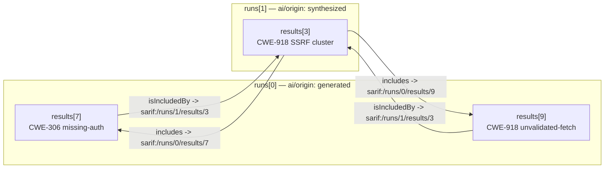

# Grouping AI Findings: Two-Tier `generated` / `synthesized` Runs

**Status:** Draft
**Scope:** A spec-legal convention for representing AI-clustered ("grouped") security
findings as a second tier of results that cross-link to the raw findings they consolidate,
within a single multi-run SARIF 2.1.0 log.

**Companion docs:**

- [`docs/ai/generating-sarif.md`](./generating-sarif.md) — the baseline AI-producer convention. This document extends it; read it first.
- [`docs/spec/sarif-v2.1.0-spec.md`](../spec/sarif-v2.1.0-spec.md) — markdown rendering of the OASIS SARIF 2.1.0 specification. Section references below (`§3.34` etc.) point into it.
- [`docs/ValidationRules.md`](../ValidationRules.md) — the validation-rule catalog. The proposed grouping rules below extend the AI profile.

Related issues: [#3051](https://github.com/microsoft/sarif-sdk/issues/3051) (multi-run `emit-finalize`), [#2520](https://github.com/microsoft/sarif-sdk/issues/2520) (`merge` does not rewrite `sarif:` pointers), [#2910](https://github.com/microsoft/sarif-sdk/issues/2910) (`index: -1` dangling references).

---

## 1. Motivation

An AI security analyzer produces findings at two levels of abstraction:

1. **Raw findings** — one `result` per individual observation (a tainted sink, a missing
   authorization check, a leaked secret). These are mechanical, high-recall, and noisy.
2. **Synthesized findings** — a *higher-level* vulnerability assembled by a skill that
   recognizes that several raw findings together constitute one exploitable condition
   (e.g., "unauthenticated SSRF reachable from the public ingress" composed of a missing
   auth check + an unvalidated URL + an outbound fetch).

Today a producer has to pick one level. Emitting only raw findings buries the signal;
emitting only synthesized findings discards the evidence. We want **both, in one log**,
with a machine-followable link from each synthesized finding to its constituents — so a
consumer can choose its own altitude:

- A UX can raise an alert **only** for each synthesized finding and present the raw
  findings as collapsed evidence underneath it.
- A different processor can ignore the synthesized tier entirely and triage raw findings
  individually.
- A baseline/suppression system can match on whichever tier it manages.

The design goal: **the grouping is data, not prose.** No message-text back-references, no
private property-bag conventions a consumer has to reverse-engineer. The links are
first-class SARIF constructs that the validator can check and any spec-compliant reader can
traverse.

---

## 2. The model

### 2.1 Two runs, one log

A grouped log is a single SARIF file with (at least) two runs, distinguished by the
existing `run.properties["ai/origin"]` vocabulary already enforced by **AI1006**:

| Run | `ai/origin` | Contents |
|---|---|---|
| `runs[0]` | `"generated"` | Raw per-finding results. |
| `runs[1]` | `"synthesized"` | Cluster results, each consolidating ≥1 generated result. |

Run order is **contractual**, not incidental — every cross-link is index-pinned (§2.3), so
`runs[0]` MUST be the generated tier and `runs[1]` the synthesized tier. (A log MAY contain
additional runs, e.g. an `annotated` tier; the convention only fixes the relative meaning of
the two tiers that participate in a grouping.)

Each synthesized result is an ordinary `result`: it carries its own `ruleId`
(`CWE-…/sub-id` per the [rule-ID convention](./generating-sarif.md#rule-id-convention)),
`message.markdown`, `level`, `rank`, locations, and any of the usual structural evidence.
It is a finding in its own right that *happens to* aggregate others.

### 2.2 Cross-linking via location relationships

The link between a synthesized result and its members rides on SARIF's native
**`locationRelationship`** mechanism (§3.34), using two of the spec's own sanctioned
relationship kinds (§3.34.3): **`includes`** and **`isIncludedBy`**.

A `locationRelationship` relates one *location* to another *location* by the target
location's `id` (§3.34.2 — `target` is a location `id`, **not** an array index). To make the
relationship cross **results** (and cross **runs**), the target location is a member of the
result's `relatedLocations[]` whose `physicalLocation.artifactLocation.uri` is a **`sarif:`
URI** pointing at the other result.

Concretely, for a synthesized cluster `runs[1].results[3]` that consolidates
`runs[0].results[7]`:

**Synthesized side (`runs[1].results[3]`)** declares what it *includes*:

```jsonc
{
  "ruleId": "CWE-918/ssrf-via-unvalidated-fetch",
  "message": { "text": "Unauthenticated SSRF reachable from public ingress." },
  "locations": [
    {
      "id": 0,
      "physicalLocation": { "artifactLocation": { "uri": "src/api/proxy.ts" }, "region": { "startLine": 40 } },
      "relationships": [
        { "target": 1, "kinds": [ "includes" ] }   // -> relatedLocations[id=1]
      ]
    }
  ],
  "relatedLocations": [
    {
      "id": 1,
      "physicalLocation": { "artifactLocation": { "uri": "sarif:/runs/0/results/7" } }
    }
  ]
}
```

**Generated side (`runs[0].results[7]`)** declares the inverse — what it *is included by*:

```jsonc
{
  "ruleId": "CWE-306/missing-auth-check",
  "locations": [
    {
      "id": 0,
      "physicalLocation": { "artifactLocation": { "uri": "src/api/proxy.ts" }, "region": { "startLine": 42 } },
      "relationships": [
        { "target": 1, "kinds": [ "isIncludedBy" ] }  // -> relatedLocations[id=1]
      ]
    }
  ],
  "relatedLocations": [
    {
      "id": 1,
      "physicalLocation": { "artifactLocation": { "uri": "sarif:/runs/1/results/3" } }
    }
  ]
}
```

A synthesized result with *N* members has *N* `relatedLocations` (each a `sarif:` pointer to
one member) and *N* `includes` relationships on its primary location. Each member carries one
`isIncludedBy` pointer back to its cluster. The relationship is reciprocal by construction.



### 2.3 `sarif:` pointers are index-fragile

A `sarif:/runs/0/results/7` pointer is a JSON-pointer-style reference resolved against the
**final** log. Its correctness depends entirely on the final `runs[]` and `results[]`
ordering. Any operation that **reorders** runs or results, or **concatenates** runs without
re-basing the embedded indices, silently corrupts every link — the pointer still parses, it
just now addresses the wrong result (or nothing).

This is the crux of the engineering work and the reason this is more than a documentation
convention:

- **`merge` is unsafe for grouped logs.** It reorders runs and does **not** rewrite `sarif:`
  pointers ([#2520](https://github.com/microsoft/sarif-sdk/issues/2520)). Observed: merging a
  generated log then a synthesized log produced `runs[0]=synthesized, runs[1]=generated` — the
  reverse of input order — which inverts the meaning of every pointer.
- **`emit-run` is one-run-per-file.** There is no native path to assemble independently
  enriched runs into one *ordered* multi-run log.

So the producer is currently forced to hand-assemble the final `runs[]` array, which is
exactly the hand-authoring the emit pipeline exists to eliminate.

---

## 3. SDK work required

### 3.1 Order-preserving multi-run `emit-finalize` (issue #3051)

Extend `emit-finalize` to replay **N ordered staged event logs** into one finalized log,
preserving caller-specified order:

```
emit-finalize out.sarif --inputs runs0.wip.jsonl runs1.wip.jsonl
# runs[0] <- runs0 (generated)   replayed + enriched + rebased
# runs[1] <- runs1 (synthesized) replayed + enriched + rebased
```

Semantics:

- **Order-preserving**: `runs[i]` ⟵ the i-th `--inputs` entry, deterministically. This is the
  property `merge` lacks and that index-pinned cross-run pointers require.
- **Per-run enrichment unchanged**: each replayed run still gets independent CWE enrichment,
  VCP rebasing, snippet insertion, and `--no-repo` / `--embed-text-files` handling.
- **Single combined validation**: `--validate` runs once over the assembled multi-run log so
  cross-run pointer resolution (§3.3) is validated as a whole.
- **Backward compatible**: the existing single positional form is unchanged.

### 3.2 Pointer stability — the SDK invariant

Whichever verb assembles the final log owns pointer correctness. Because `emit-finalize`
`--inputs` fixes run order deterministically and never reorders results within a run, the
pointers a producer stamped against its intended `runs[i]/results[j]` layout remain valid.
The SDK MUST NOT silently reorder runs or results in any path a grouped log flows through.
If we later teach `merge` to be pointer-safe (#2520), it must **rewrite** `sarif:` indices to
track the runs/results it relocates; until then, `merge` stays documented as unsafe for
grouped logs and grouped producers use multi-run `emit-finalize`.

### 3.3 New validation rules (AI profile)

Three checks, layered from general to grouping-specific. (IDs proposed; finalize during
implementation — see the plan. `AI1xxx` = Error/MUST, `AI2xxx` = Warning/SHOULD.)

1. **`sarif:` pointers MUST resolve (proposed `AI1014`, Error).** Every `sarif:` URI anywhere
   in the log (artifactLocation, related locations, etc.) MUST resolve to an element that
   exists in the final log. This is the general index-fragility net the AI friends asked for
   — it catches a dangling `sarif:/runs/0/results/7` regardless of grouping. Pairs naturally
   with the `index: -1` family ([#2910](https://github.com/microsoft/sarif-sdk/issues/2910)).

2. **Grouping links MUST be reciprocal (proposed `AI1015`, Error).** If
   `runs[s].results[i]` (synthesized) `includes` `runs[g].results[j]` via a `sarif:` pointer,
   then `runs[g].results[j]` MUST carry the inverse `isIncludedBy` pointer back to
   `runs[s].results[i]`, and vice versa. A one-way link is a producer bug: a consumer that
   followed only one direction would build an inconsistent view.

3. **Grouping respects the origin tiers (proposed `AI2020`, Warning).** An `includes` edge
   SHOULD originate in a `synthesized` run and target a `generated` (or `annotated`) run —
   not the reverse, and not within the same tier. Warning, not Error, because the spec permits
   richer topologies; this rule encodes the *convention* this document describes, so a
   producer that deliberately departs from it can suppress.

These join the existing AI catalog (`AI1006` already constrains `ai/origin`); they do not
change any base-profile (`Sarif`) behavior.

### 3.4 Skill / doc surface

- `skills/emit-sarif` gains a "grouping findings" section: how to stamp the `sarif:` pointers,
  the reciprocity requirement, and the `emit-finalize --inputs` invocation.
- `generating-sarif.md` cross-links here from its `ai/origin` and relationships sections.
- A worked sample log (generated + synthesized, fully cross-linked, validates clean under
  `Sarif;AI`) ships as a fixture, regenerated by a `*GenerateSample.ps1` per the repo's sample
  convention and gated by a byte-identical regen `[Fact]`.

---

## 4. Consumer contract (what a reader may rely on)

A reader that understands this convention may rely on:

- `run.properties["ai/origin"]` partitions runs into tiers; `synthesized` runs hold clusters.
- A synthesized result's members are exactly the results its primary-location `includes`
  relationships resolve to (via the `sarif:` pointers in its `relatedLocations`).
- Every member result resolves back via `isIncludedBy` (reciprocity is validator-enforced).
- A consumer that ignores the synthesized tier loses no raw findings; a consumer that ignores
  the generated tier loses no synthesized findings (the synthesized result is self-contained —
  it has its own message, rule, level, and locations).

A reader that does **not** understand the convention still gets a valid SARIF log: the extra
run and the relationships are inert but spec-legal, and the `sarif:` related locations resolve
to real results.

---

## 5. Open questions (resolve during planning)

1. **Rule IDs.** Confirm `AI1014` / `AI1015` / `AI2020` (and whether the reciprocity + tier
   checks should be one rule or two). `AI1015` was historically floated for a different,
   rejected purpose ([#2953](https://github.com/microsoft/sarif-sdk/issues/2953)) — pick a
   clean unused id if reuse is confusing.
2. **Scope of `AI1014`.** Validate *all* `sarif:` pointers (general), or only the
   grouping-related ones? Recommendation: general — the index-fragility net is valuable
   independent of grouping.
3. **`merge` vs. multi-run `emit-finalize`.** Ship multi-run `emit-finalize` first (#3051);
   treat pointer-safe `merge` (#2520) as a separate, later effort.
4. **Same-log requirement.** This convention assumes generated + synthesized live in **one**
   log so `sarif:` pointers resolve. Cross-*file* grouping is out of scope.
